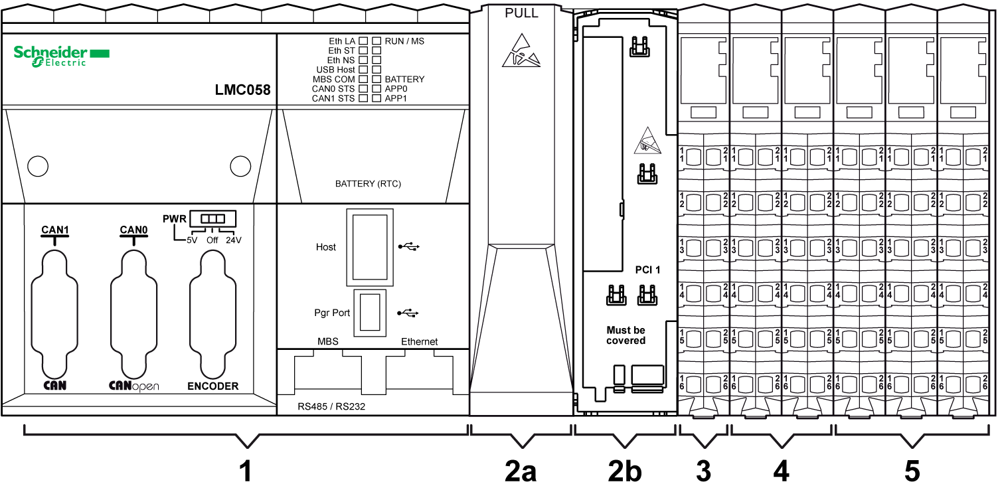

# M258 / LMC058 Controller Main Features

M258 / LMC058 Controller Main Features

The following figure gives the main features of a controller:

1   Controller

2a   PCI slot with cover

2b   PCI slot with cover removed

3   Controller Power Distribution Module (CPDM)

4   Embedded expert I/Os

5   Embedded regular I/Os