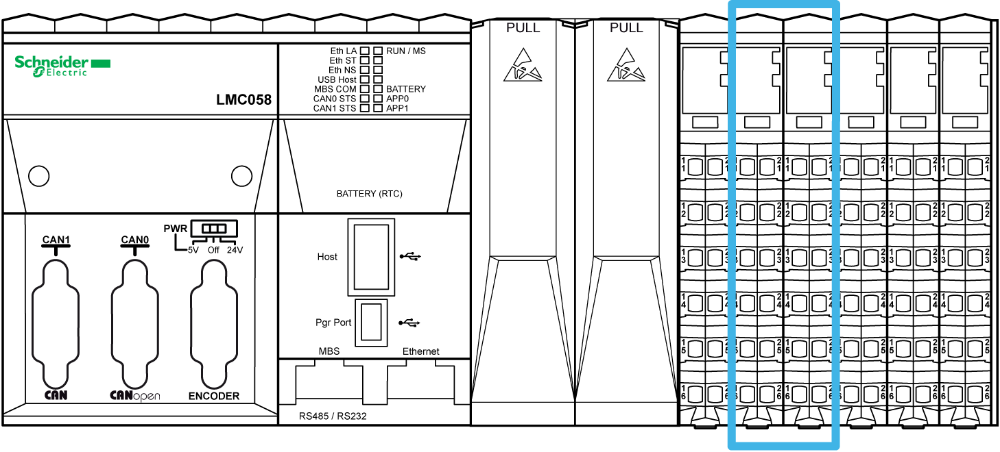

# Embedded Expert I/Os

Embedded Expert I/Os

The following figure shows the location of the expert I/Os of the controller:

The controllers have two embedded expert I/O groups. Each group contains:

o5 [fast inputs](../glossary/glossary.htm#XREF_D_SE_0024697_699)

o2 regular inputs

o2 [fast outputs](../glossary/glossary.htm#XREF_D_SE_0024697_699)

Each group can be configured as:

o1 to 4 simple High Speed Counters (HSC)

o1 main [HSC](../glossary/glossary.htm#XREF_D_SE_0024697_574)

o1 Pulse Width Modulated ([PWM](../glossary/glossary.htm#XREF_D_SE_0024697_503)) output

o1 frequency generator

o1 encoder interface

Fast inputs resolution is up to 200 kHz.

NOTE: When a fast input is not used by special function, it can be used as a regular input.

Fast outputs resolution is up to 100 kHz.

NOTE: When a fast output is not used by special function, it can be used as a regular output.