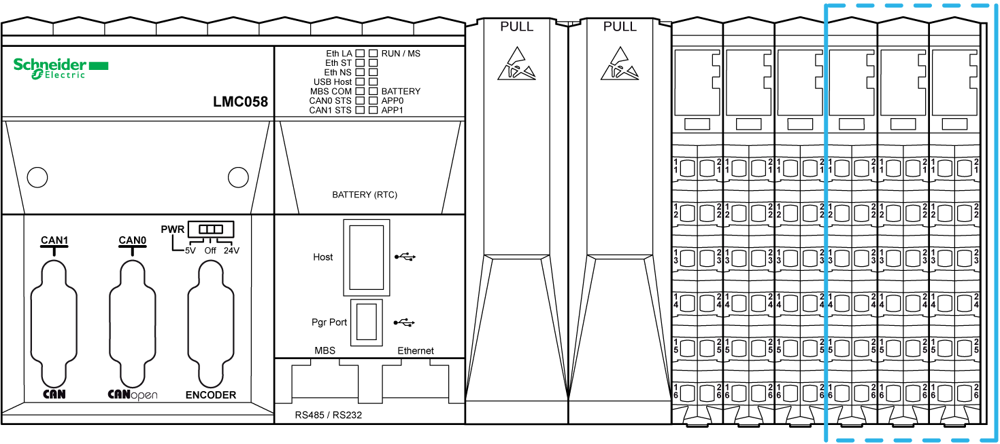

# Embedded Regular I/Os

Embedded Regular I/Os

The following figure shows the location of the embedded regular I/Os of the controller:

The following table gives a short description of the different regular I/Os embedded in the controller, depending on the controller reference:

| Regular I/Os | Short Description |
| --- | --- |
| [Digital Inputs](../glossary/glossary.htm#XREF_D_SE_0024697_674) | 24 Vdc [sink](../glossary/glossary.htm#XREF_D_SE_0024697_376) / 1 or 2 wires / input Type 1 |
| [Digital Outputs](../glossary/glossary.htm#XREF_D_SE_0024697_674) | 24 Vdc [source](../glossary/glossary.htm#XREF_D_SE_0024697_409) / 1 wire / transistor / 0.5 A |
| [Analog Inputs](../glossary/glossary.htm#XREF_D_SE_0024697_624) | 12 bit resolution / -10...+10 Vdc / 0...20 mA / 4...20 mA |
| Relay Outputs | 2 A / 30 Vdc / 240 Vac |