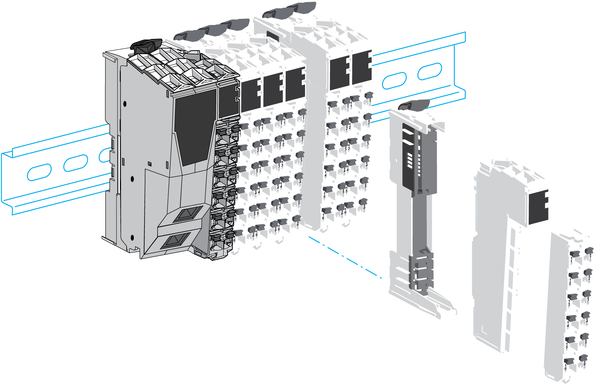

# Introduction

Introduction

The TM5 field bus interface is the first element of the [TM5 distributed I/O island](../Intro_-_Description_of_the_TM5_and_TM7_System/Intro_-_Description_of_the_TM5_and_TM7_System-3.htm#XREF_D_SE_0009280_3).

The following figure shows the location of the TM5 field bus interface in a distributed I/O island:

