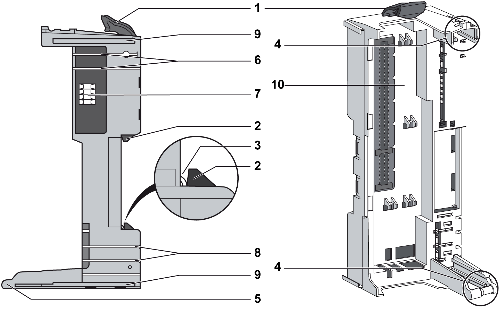

# Field Bus Interface Bus Base Description

Field Bus Interface Bus Base Description

The following figure shows the different parts of the field bus interface bus base:

1   Locking lever

2   DIN rail locking mechanism

3   DIN rail contact

4   Guides for assembly of the IPDM

5   Rotation axle for terminal block

6   TM5 bus power contacts

7   TM5 bus data contacts

8   24 Vdc I/O power segment contacts

9   Interlocking guides

10   Slot for bus interface module

The following table gives the available reference:

| Reference | Field Bus Interface Bus Base Description | Color |
| --- | --- | --- |
| TM5ACBN1 | Bus base for field bus interface module and Interface Power Distribution Module [(IPDM)](#XREF_D_SE_0015378_6) | White |