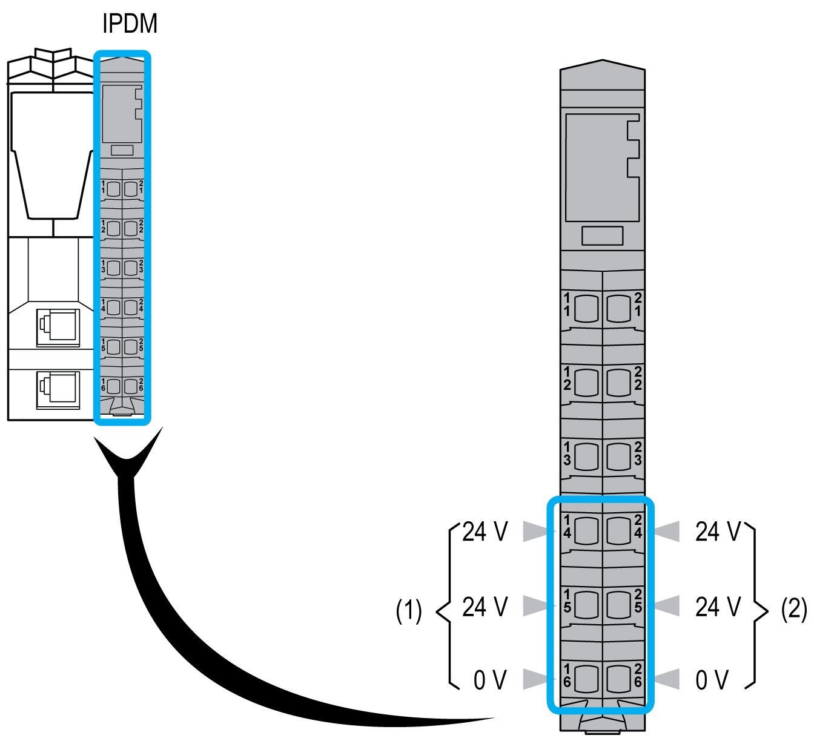

# Terminal Block Description

Terminal Block Description

The following table gives the available reference:

| Reference | [Terminal Block Description](SPIG_TM5_TM7_-_Basics_of_the_TM5_System-5.htm#XREF_D_SE_0015379_7) | Color |
| --- | --- | --- |
| TM5ACTB12PS | [24 Vdc, 12-pin terminal block for PDM, IPDM and Receiver electronic module](../TM5_Bus_bases_and_Terminal_blocks/TM5_Bus_bases_and_Terminal_blocks-3.htm#XREF_D_SE_0015419_1) | Gray |

The following figure shows the terminal block assignments of the IPDM:

(1)   24 Vdc Main power

(2)   24 Vdc I/O power segment