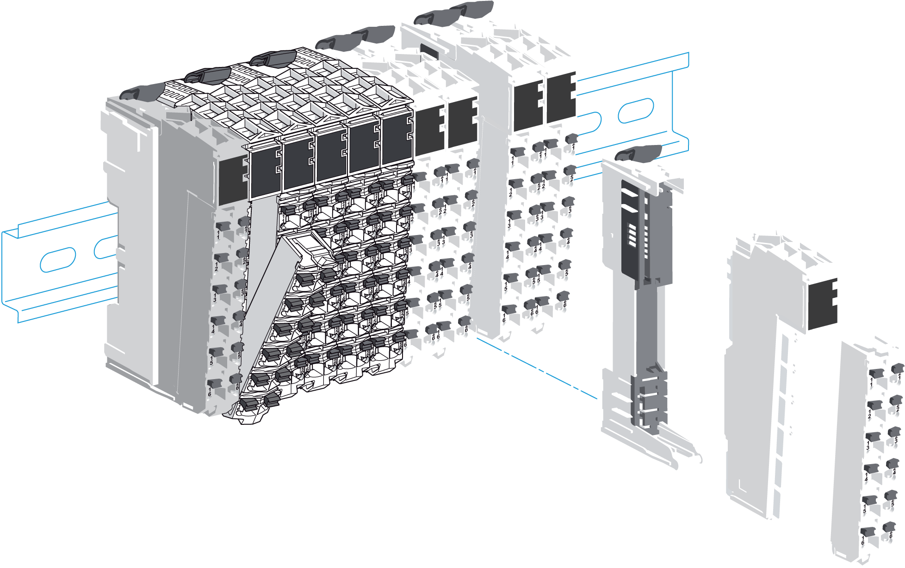

# Introduction

Introduction

The TM5 Compact I/O are I/O expansion modules for your TM5 system. The compact I/O module is a group of TM5 electronic I/O modules under a single reference. The individual electronic modules are identified by an abbreviated designation on their front face, while the reference of the entire group can be found on the side of the [compact I/O module](../glossary/glossary.htm#XREF_D_SE_0024697_658). The abbreviated designation on the individual module faces corresponds to the last characters of the individual module references.The terminals blocks are assembled on the compact I/O when delivered.

The compact I/O uses a single address on the TM5 Bus.

The electronic modules included in the compact I/O are not individually replaceable.

NOTE: Unlike the individual TM5 digital and analog I/O electronic modules, the compact I/O do not have hot-swap capability. Do not attempt to hot swap these modules.

|  |
| --- |
| Warning_Color.gifWARNING |
| UNINTENDED EQUIPMENT OPERATION |
| Do not attempt to hot swap TM5 Compact I/O. |
| Failure to follow these instructions can result in death, serious injury, or equipment damage. |

The following figure shows a TM5 Compact I/O as the second component of a remote island:

