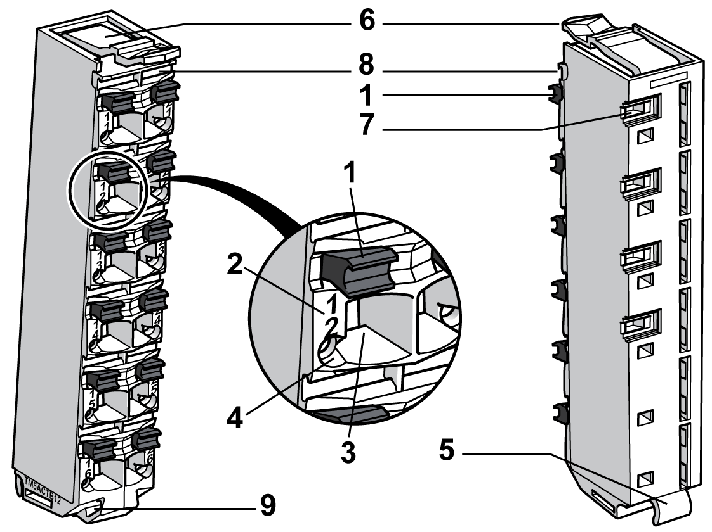

# Terminal Block Description

Terminal Block Description

The main features of the terminal block are:

oTool-free wiring with spring clamp push-in technology

oPush-button wire release

oAbility to [label](../TM5_-_Flexible_TM5_System_Installation/TM5_-_Flexible_TM5_System_Installation-14.htm#XREF_D_SE_0001023_3) each terminal

o[Plain text labeling](../TM5_-_Flexible_TM5_System_Installation/TM5_-_Flexible_TM5_System_Installation-15.htm#XREF_D_SE_0001024_5) also possible

o[Test access](../TM5_-_Commissioning_and_Startup/TM5_-_Commissioning_and_Startup-2.htm#XREF_D_SE_0002456_4) for standard probes

oCan be [custom-coded](../TM5_-_Flexible_TM5_System_Installation/TM5_-_Flexible_TM5_System_Installation-13.htm#XREF_D_SE_0000888_1)

The following figure shows the different parts of the terminal block:

1   Wire release push-button

2   Pin assignment

3   Spring clamp connector

4   Test access point

5   Hinge for the axle on the bus base

6   Latch for the electronic module

7   Back slot for coding

8   Front slot for labeling

9   Slot for cable tie

This table gives the different types of [terminal blocks](../TM5_Bus_bases_and_Terminal_blocks/TM5_Bus_bases_and_Terminal_blocks-3.htm#XREF_D_SE_0015419_1):

| Reference | Terminal Block Description | Color |
| --- | --- | --- |
| TM5ACTB06 | 24 Vdc, 6-pin terminal block | White |
| TM5ACTB12 | 24 Vdc, 12-pin terminal block | White |
| TM5ACTB12PS | 24 Vdc, 12-pin terminal block for PDM, IPDM and Receiver electronic module | Gray |
| TM5ACTB16 | 24 Vdc, 16-pin terminal block | White |
| TM5ACTB32 | 240 Vac, 12-pin terminal block | Black |