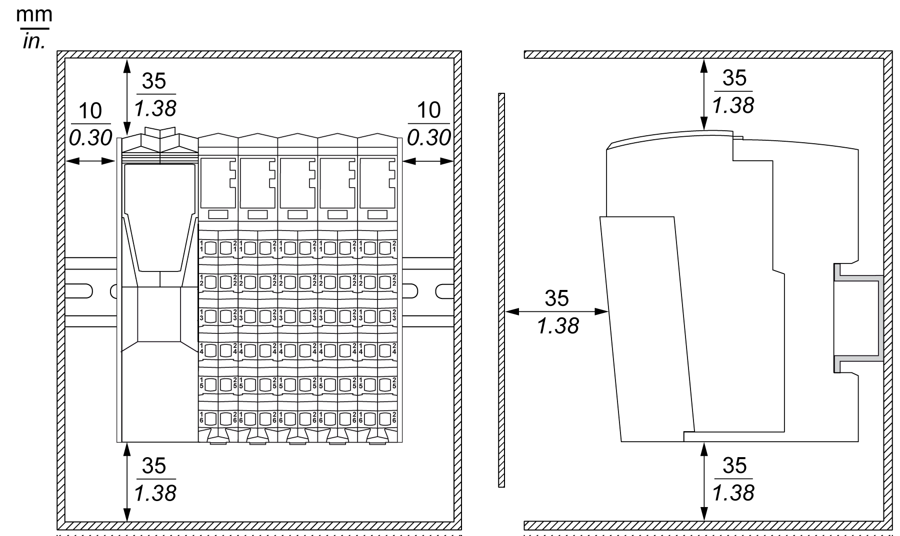

# Spacing Requirements

Spacing Requirements

NOTE: Keep adequate spacing for proper ventilation and to maintain an ambient temperature as described in the [environmental characteristics](TM5_-_Initial_Planning_for_TM5-2.htm#XREF_D_SE_0015384_1).

Clearances must be respected when installing the product.

There are 3 types of clearances:

oBetween the TM5 System and all sides of the cabinet (including the panel door). This type of clearance allows proper circulation of air around the TM5 System.

oBetween the TM5 System terminal blocks and the wiring ducts. This distance helps avoid electromagnetic interference between the controller and the wiring ducts.

oBetween the TM5 System and other heat generating devices installed in the same cabinet.

|  |
| --- |
| Warning_Color.gifWARNING |
| UNINTENDED EQUIPMENT OPERATION |
| oPlace devices dissipating the most heat at the top of the cabinet and ensure adequate ventilation.  oAvoid placing this equipment next to or above devices that might cause overheating.  oInstall the equipment in a location providing the minimum clearances from all adjacent structures and equipment as directed in this document.  oInstall all equipment in accordance with the specifications in the related documentation. |
| Failure to follow these instructions can result in death, serious injury, or equipment damage. |

The following graphic represents the minimum clearance requirements for a TM5 System in a cabinet:

