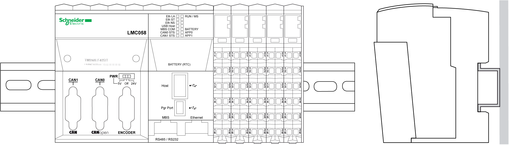

# Correct Mounting Position

Correct Mounting Position

The TM5 System must be mounted horizontally on a vertical plane as shown in the figures below:

NOTE: Keep adequate spacing for proper ventilation and to maintain an ambient temperature as described in the [environmental characteristics](TM5_-_Initial_Planning_for_TM5-2.htm#XREF_D_SE_0015384_1).