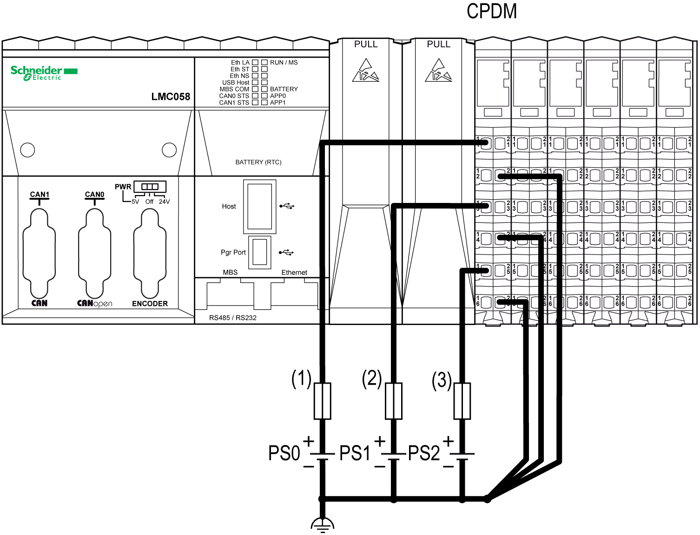

# Wiring the Controller Power Distribution Module (CPDM)

Wiring the Controller Power Distribution Module (CPDM)

The [CPDM](TM5_-_Initial_Planning_for_TM5-7.htm#XREF_D_SE_0002686_21) is the connection of the controller to the external 24 Vdc power supplies and the beginning of the power distribution for the local configuration. Power can be supplied by two or three external isolated power supplies depending on current needs and capabilities.

There are three power connections to be made to the CPDM from your source power supplies:

| Connections | 2 Power Supplies | 3 Power Supplies |
| --- | --- | --- |
| 24 Vdc embedded expert modules power | PS1 | PS0 |
| 24 Vdc Main power that generates power for TM5 power bus | PS1 |
| 24 Vdc I/O power segment | PS2 | PS2 |

The following figure shows a CPDM wired with two separate external 24 Vdc power supplies:

(1)   External fuse, Type T slow-blow, 3 A, 250 V

(2)   External fuse, Type T slow-blow, 2 A, 250 V

(3)   External fuse, Type T slow-blow, 10 A max., 250 V

PS1/PS2   External isolated power supplies 24 Vdc

NOTE: Connect the 0 Vdc power circuits together and to the functional ground (FE) of your system. If you do not interconnect the 0 Vdc circuits of the external power supplies, the status LEDs may not function correctly. In addition, there may potentially be more significant consequences such as an explosion and/or fire hazard.

|  |
| --- |
| Danger_Color.gifDANGER |
| POTENTIAL EXPLOSION OR FIRE |
| Always connect the 0 Vdc terminals of the external power supplies to the functional ground (FE) of your system. |
| Failure to follow these instructions will result in death or serious injury. |

The following figure shows the wiring of the CPDM with three separate external 24 Vdc power supplies:

(1)   External fuse, Type T slow-blow, 3 A, 250 V

(2)   External fuse, Type T slow-blow, 2 A, 250 V

(3)   External fuse, Type T slow-blow, 10 A max., 250 V

PS0/PS1/PS2   External isolated power supply 24 Vdc

NOTE: Connect the 0 Vdc power circuits together and to the functional ground (FE) of your system. If you do not interconnect the 0 Vdc circuits of the external power supplies, the status LEDs may not function correctly. In addition, there may potentially be more significant consequences such as an explosion and/or fire hazard.

|  |
| --- |
| Danger_Color.gifDANGER |
| POTENTIAL EXPLOSION OR FIRE |
| Always connect the 0 Vdc terminals of the external power supplies to the functional ground (FE) of your system. |
| Failure to follow these instructions will result in death or serious injury. |