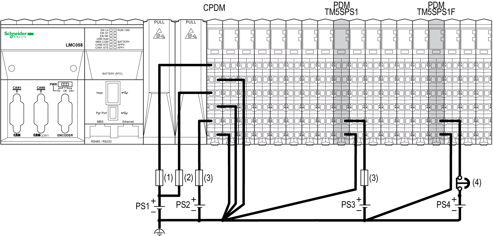

# Wiring the Power Distribution Module TM5SPS1•

Wiring the Power Distribution Module TM5SPS1•

The TM5SPS1• (PDM) divides the 24 Vdc I/O power segment into several separated [24 Vdc I/O power segments](TM5_-_Initial_Planning_for_TM5-7.htm#XREF_D_SE_0002686_18). Each separated 24 Vdc I/O power segment is supplied by one external isolated power supply depending on current needs and capabilities.

There is one power connection to be made to each TM5SPS1• (PDM) from your source power supplies:

| Segment Begin | Connection | Power Supplies |
| --- | --- | --- |
| CPDM for local configuration or the receiver module for remote configuration or the IPDM for distributed configuration | 24 Vdc I/O power segment 1 | PS2 |
| First PDM (from left to right) of the configuration | 24 Vdc I/O power segment 2 | PS3 |
| Second PDM (from left to right) of the configuration | 24 Vdc I/O power segment 3 | PS4 |
| ... | ... | ... |

The following figure shows the wiring to supply the 24 Vdc I/O power segments of a local configuration:

(1)   External fuse, Type T slow-blow, 3 A, 250 V

(2)   External fuse, Type T slow-blow, 2 A, 250 V

(3)   External fuse, Type T slow-blow, 10 A max., 250 V

(4)   Approved emergency stop device

PS1/PS2/PS3/PS4   External isolated power supply 24 Vdc

NOTE: Connect the 0 Vdc power circuits together and to the functional ground (FE) of your system. If you do not interconnect the 0 Vdc circuits of the external power supplies, the status LEDs may not function correctly. In addition, there may potentially be more significant consequences such as an explosion and/or fire hazard.

|  |
| --- |
| Danger_Color.gifDANGER |
| POTENTIAL EXPLOSION OR FIRE |
| Always connect the 0 Vdc terminals of the external power supplies to the functional ground (FE) of your system. |
| Failure to follow these instructions will result in death or serious injury. |

NOTE: The requirements for the power supply are different for the input and the output slices. An emergency stop is generally used with the power supply providing power for output slices.