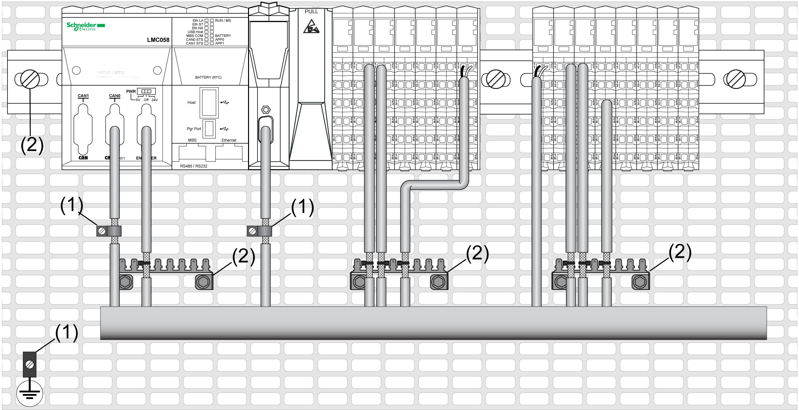

# Introduction

Introduction

Use shielded, properly grounded cables for all analog and high-speed inputs or outputs and communication connections. If you do not use shielded cable for these connections, electromagnetic interference can cause signal degradation. Degraded signals can cause the controller or attached modules and equipment to perform in an unintended manner.

|  |
| --- |
| Warning_Color.gifWARNING |
| UNINTENDED EQUIPMENT OPERATION |
| oUse shielded cables for all fast I/O, analog I/O and communication signals.  oGround cable shields for all analog I/O, fast I/O and communication signals at a single point1.  oRoute communication and I/O cables separately from power cables. |
| Failure to follow these instructions can result in death, serious injury, or equipment damage. |

1Multipoint grounding is permissible if connections are made to an equipotential ground plane dimensioned to help avoid cable shield damage in the event of power system short-circuit currents.

The   use of shielded cables requires compliance with the following wiring rules:

oFor protective ground connections ([PE](../glossary/glossary.htm#XREF_D_SE_0024697_501)), metal conduit or ducting can be used for part of the shielding length, provided there is no break in the continuity of the ground connections. For functional ground ([FE](../glossary/glossary.htm#XREF_D_SE_0024697_704)), the shielding is intended to attenuate electromagnetic interference and the shielding must be continuous for the length of the cable. If the purpose is both functional and protective, as is often the case for communication cables, the cable should have continuous shielding.

oWherever possible, keep cables carrying one type of signal separate from the cables carrying other types of signals or power.

The figure below represents a TM5 System with shielded cables:

1   Protective ground (PE)

2   Functional ground (FE)