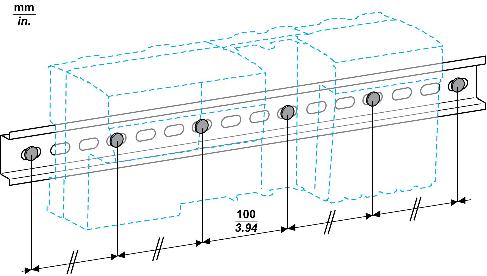

# Mounting the DIN Rail

Mounting the DIN Rail

The TM5 System components are designed for mounting on rail conforming to [IEC](../glossary/glossary.htm#XREF_D_SE_0024697_75) 60715.

To help achieve the stated TM5 System performance characteristics, the mounting hardware must be installed at the end positions and at 100 mm (3.94 in.) maximum increments along the length of the rail.

|  |
| --- |
| Warning_Color.gifWARNING |
| UNINTENDED EQUIPMENT OPERATION |
| oVerify that the DIN rail is securely installed with mounting hardware at the end positions and at 100 mm (3.94 in.) maximum increments along the length of the rail.  oBe sure that the DIN rail is firmly connected to a conductive backplane, and that the conductive backplane is secured to a protective ground as specified in this guide and in accordance with local regulations. |
| Failure to follow these instructions can result in death, serious injury, or equipment damage. |

The following figure illustrates the mounting requirements for the DIN rail:

Low profile NSYSDR200D DIN rail may be used with low profile mounting hardware such as flat head screws with countersunk mounting holes.

NOTE: If you use NSYSDR200D DIN rail, ensure that the maximum fastener screw head protrusion does not exceed 1.0 mm (0.039 in.) above the inner surface of the DIN rail.