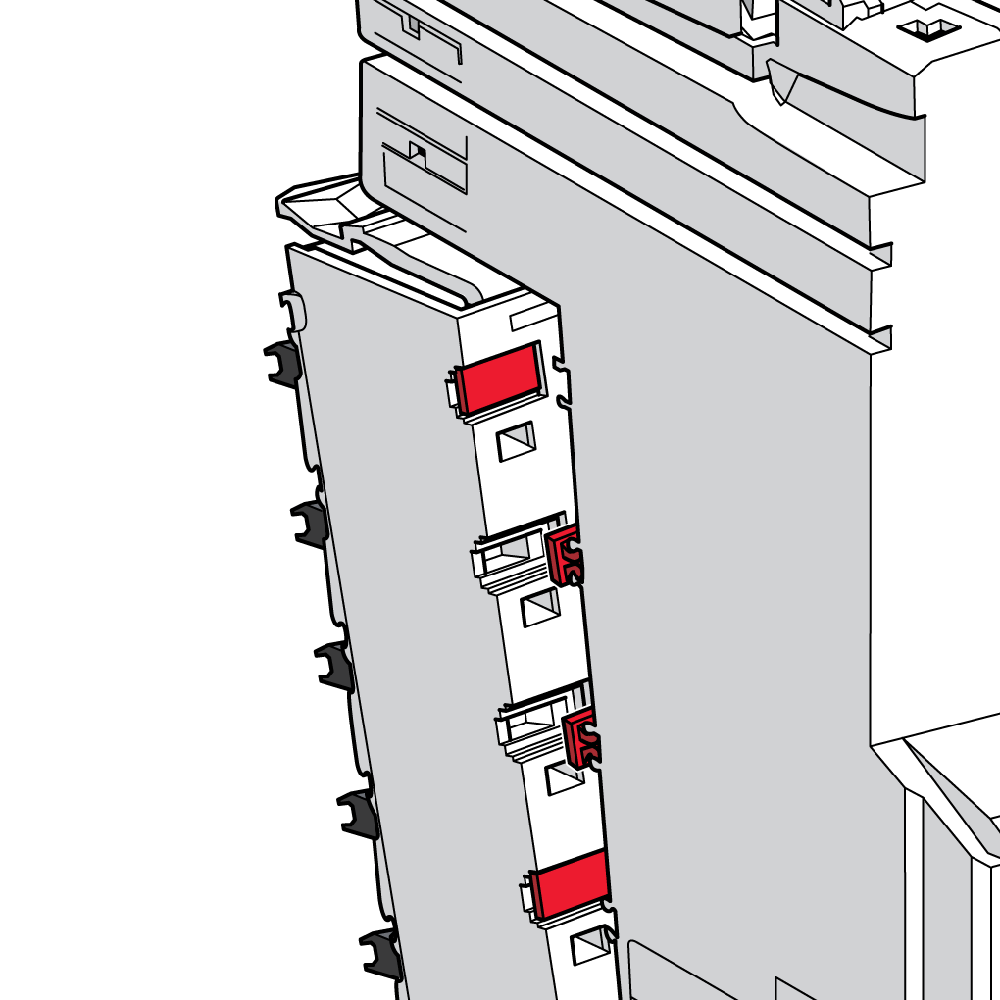

# Introduction

Introduction

To help reduce the likelihood of mismatches during mounting and maintenance operations, the association between the terminal blocks and the electronic modules can be coded.

The following image illustrates a coding of the electronic module and of the terminal block:

The [label tabs and labeling tool](../SPIG_TM5_TM7_-_Basics_of_the_TM5_System/SPIG_TM5_TM7_-_Basics_of_the_TM5_System-6.htm#XREF_D_SE_0000784_5) accessories are required to code the terminal block and the electronic module.