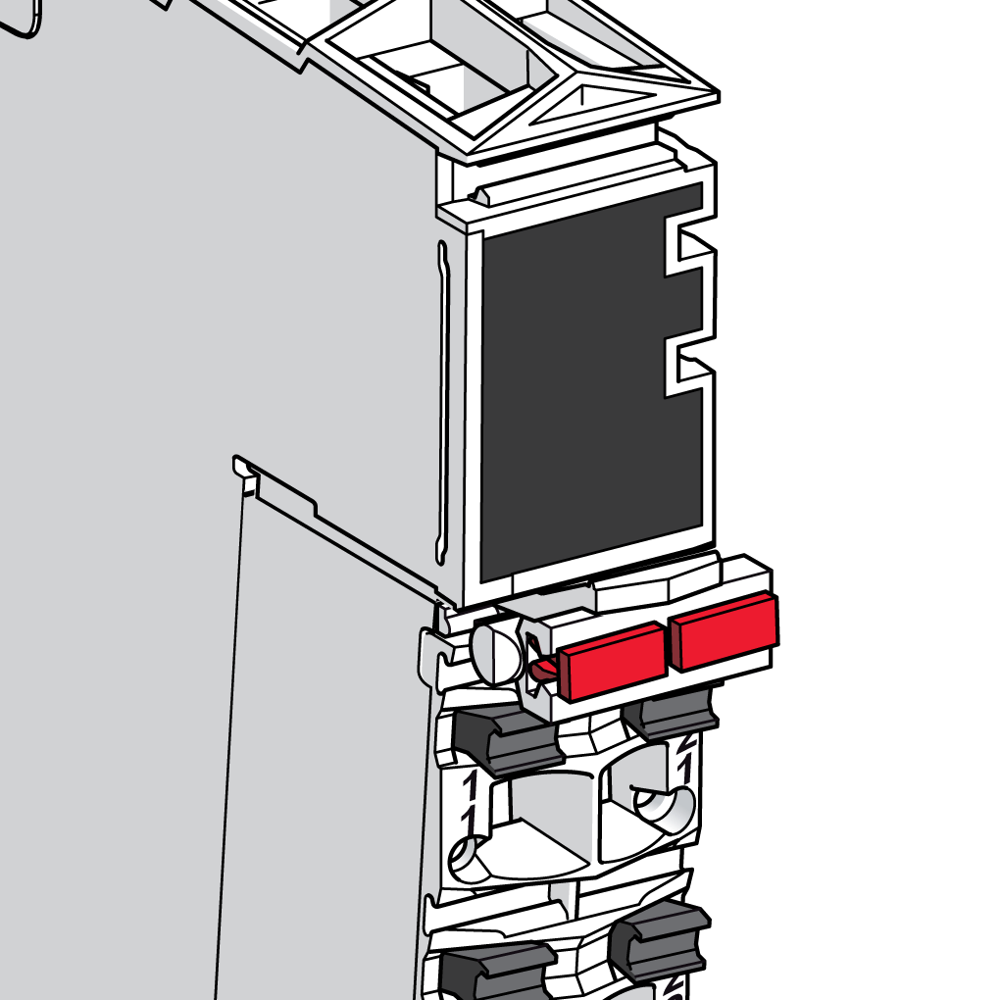

# Labeling the Terminal Locking Clip

Labeling the Terminal Locking Clip

To label the terminal block itself, insert one or two label tabs in the [terminal locking clip](../SPIG_TM5_TM7_-_Basics_of_the_TM5_System/SPIG_TM5_TM7_-_Basics_of_the_TM5_System-6.htm#XREF_D_SE_0000784_7) using the same procedure described above.

The following figure shows the labeled terminal locking clip:

