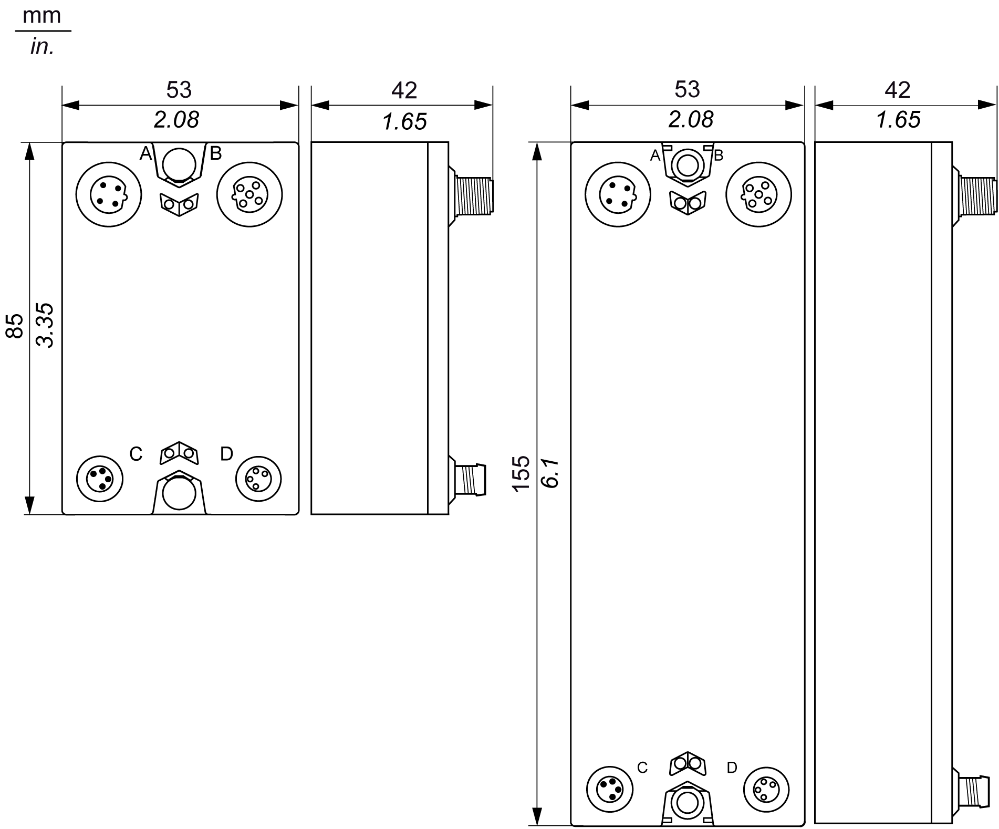

# Dimensions

Dimensions

The following figure gives the dimensions of the size 1 (left) and size 2 (right) blocks:

The following tables give the sizes of the blocks:

| TM7 field bus interface I/O blocks | | | |
| --- | --- | --- | --- |
| Type of block | Reference | Size 1 | Size 2 |
| CANopen | TM7NCOM08B | x |  |
| TM7NCOM16A |  | x |
| TM7NCOM16B |  | x |

| TM7 I/O Blocks | | | |
| --- | --- | --- | --- |
| Type of block | Reference | Size 1 | Size 2 |
| Digital input | TM7BDI8B | x |  |
| TM7BDI16B |  | x |
| TM7BDI16A |  | x |
| Digital mixed [input/output](../glossary/glossary.htm#XREF_D_SE_0024697_726) | TM7BDM8B | x |  |
| TM7BDM16A |  | x |
| TM7BDM16B |  | x |
| Digital output | TM7BDO8TAB | x |  |
| Analog input | TM7BAI4VLA | x |  |
| TM7BAI4CLA | x |  |
| TM7BAI4TLA | x |  |
| TM7BAI4PLA | x |  |
| Analog mixed input/output | TM7BAM4VLA | x |  |
| TM7BAM4CLA | x |  |
| Analog output | TM7BAO4VLA | x |  |
| TM7BAO4CLA | x |  |

| TM7 Power Distribution Block (PDB) | | | |
| --- | --- | --- | --- |
| Type of block | Reference | Size 1 | Size 2 |
| PDB Power Distribution Block | TM7SPS1A | x |  |