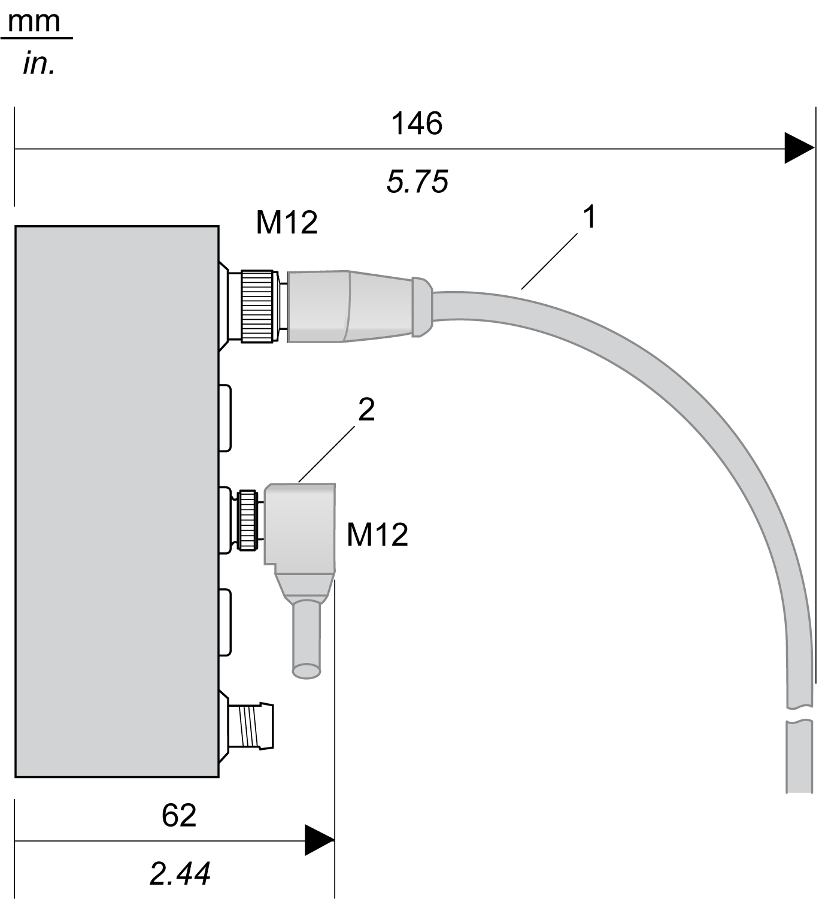

# Spacing Requirements

Spacing Requirements

TM7 blocks can be installed side-by-side. However, you must observe the minimum spacings from the front face of each expansion block, based on cable connector type and [cable bend radius](../TM7_Cables/TM7_Cables-1.htm#XREF_D_SE_0009890_1).

The following figure shows an example of wire bending requirements for a block connected with pre-wired straight cables and elbowed cables:

1   Straight cable

2   Elbowed cable