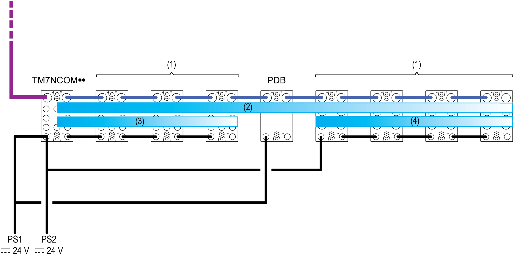
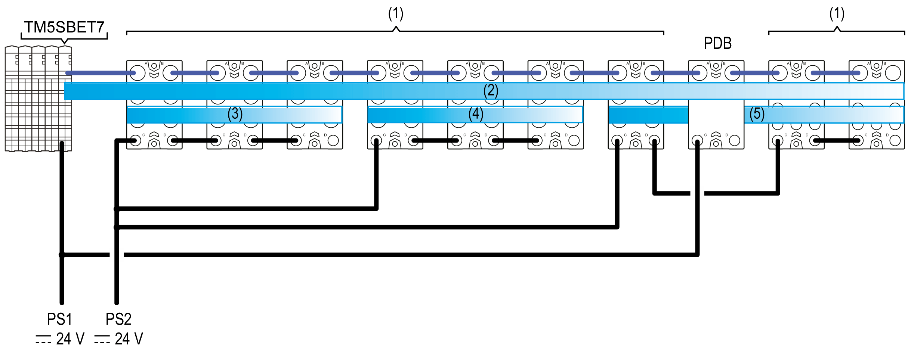

# Power Distribution Overview

Power Distribution Overview

The field bus interface I/O block is the beginning of the power distribution for the [TM7 distributed configuration](../Intro_-_Description_of_the_TM5_and_TM7_System/Intro_-_Description_of_the_TM5_and_TM7_System-3.htm#XREF_D_SE_0009280_4), it distributes power for the 24 Vdc I/O power segment and generates power for the TM7 power bus.

In a [remote configuration](../Intro_-_Description_of_the_TM5_and_TM7_System/Intro_-_Description_of_the_TM5_and_TM7_System-2.htm#XREF_D_SE_0000756_4), the TM5SBET7 Transmitter module generates power for the TM7 power bus. The first I/O block of the remote configuration after a TM5SBET7 distributes power for the first 24 Vdc I/O power segment.

There are other components that generate supplemental power to the TM7 power bus, or distribute power to create separate 24 Vdc I/O power segments. For example, Power Distribution Blocks (PDB) can be added to provide supplementary power to the TM7 power bus if required by your I/O configuration. Another example, you connect a power supply to a I/O block to divide the 24 Vdc I/O power segment into several separated 24 Vdc I/O power segments.

The figure below demonstrates power distribution for a TM7 remote configuration. Refer to the section [Wiring the Power Supply](TM7_Part_-_Initial_Planning_for_TM7_System-12.htm#XREF_D_SE_0009316_1) for details on connector wiring:

(1)   TM7 I/O blocks

(2)   TM7 Power bus

(3...4)   24 Vdc I/O power segments

TM7NCOM••   TM7 field bus interface I/O blocks

PDB   Power Distribution Block

PS1   External isolated main power supply, 24 Vdc

PS2   External isolated I/O power supply, 24 Vdc

The figure below shows a representation of the power distribution overview for a remote configuration. Refer to the section [Wiring the Power Supply](TM7_Part_-_Initial_Planning_for_TM7_System-12.htm#XREF_D_SE_0009316_1) for details on connectors wiring:

(1)   TM7 I/O blocks

(2)   TM7 Power bus

(3...5)   24 Vdc I/O power segments

TM5SBET7   Transmitter module

PDB   Power Distribution Block

PS1   External isolated main power supply, 24 Vdc

PS2   External isolated I/O power supply, 24 Vdc