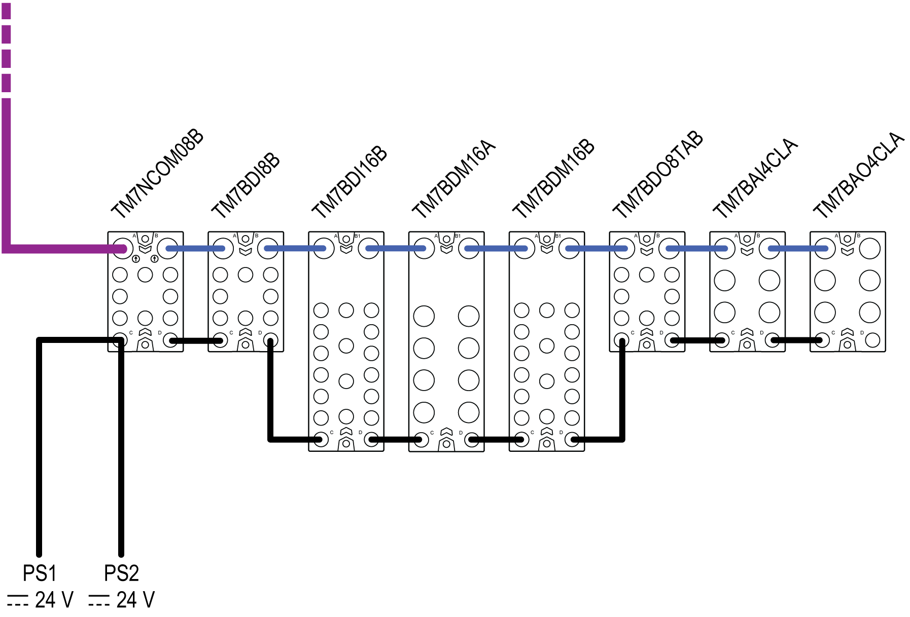

# Planning Example

Planning Example

This configuration example includes:

oThe CANopen interface I/O block TM7NCOM08B equipped with 8 digital input or output configurable channels.

oSome expansion blocks:

oTM7BDI8B

oTM7BDI16B

oTM7BDM16A

oTM7BDM16B

oTM7BDO8TAB

oTM7BAI4CLA

oTM7BAO4CLA

oAssumptions used for the purposes of calculating the consumption of this example:

TM7NCOM08B: The maximum current distributed on the 24 Vdc I/O power segment is limited by an external isolated power supply of 4000 mA.

TM7BDI8B: The current to supply the electronic sensors of this example has been estimated at 25 mA per sensor, or 200 mA total for the block.

TM7BDM16A: The sum of the current draw for all outputs connected to the block is never more than 2500 mA at any given time.

TM7BDM16B: The sum of the current draw for all outputs connected to the block is never more than 1500 mA at any given time.

The current to supply the electronic sensors of this example has been estimated at 25 mA per sensor, or 200 mA total for the block.

TM7BDO8TAB: Only 5 of the outputs are active at any given time, and that the maximum current draw of any given output is 1000 mA, or 5000 mA total for the block.

The following graphic shows the example configuration connected to the power supplies PS1 and PS2:

PS1   External isolated main power supply, 24 Vdc

PS2   External isolated I/O power supply, 24 Vdc

Refer to the section [Wiring the Power Supply](TM7_Part_-_Initial_Planning_for_TM7_System-12.htm#XREF_D_SE_0009316_1) for more information.

The following table shows the current supplied and consumed in mA on the TM7 power bus and the 24 Vdc I/O power segment:

| TM7NCOM08B | TM7BDI8B | TM7BDI16B | TM7BDM16A | TM7BDM16B | TM7BDO8TAB | TM7BAI4CLA | TM7BAO4CLA | Legend |
| --- | --- | --- | --- | --- | --- | --- | --- | --- |
| 150 |  |  |  |  |  |  |  | (1) |
|  | 38 | 38 | 38 | 38 | 38 | 38 | 38 | (2) |
|  | 112 | 74 | 36 | –2 | –40 | –78 | –116 | (3) |
| 4000 |  |  |  |  |  |  |  | (4) |
| 84 | 42 | 21 | 125 | 125 | 84 | 125 | 188 | (5) |
| 800 | 0 | 0 | 2500 | 1500 | 5000 | – | – | (6) |
| 100 | 200 | 0 | 0 | 200 | – | – | – | (7) |
| 984 | 242 | 21 | 2625 | 1625 | 5484 | 125 | 188 | (8) |
| 3016 | 2774 | 2753 | 128 | –1697 | –6781 | –6906 | –7094 | (9) |
| Legend:  External isolated main power supply, 24 Vdc  (1) Current supplied on the TM7 power bus  (2) Consumption of the TM7 I/O block  (3) Remaining current available after block consumption  External isolated I/O power supply, 24 Vdc  (4) Current supplied on the 24 Vdc I/O power segment  (5) Consumption of the electronics of the TM7 I/O block  (6) Consumption of the loads of the output channels  (7) Consumption of the supply to sensors, actuators or external devices  (8) Total TM7 I/O block consumption  (9) Remaining current available after block consumption | | | | | | | | |