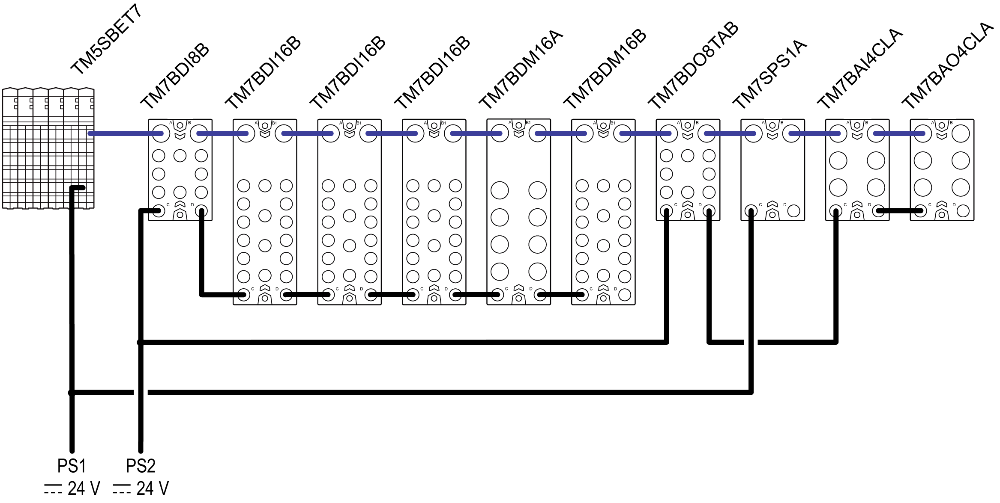

# Current Consumed on the TM7 Power Bus

Current Consumed on the TM7 Power Bus

The TM5SBET7 generates 304 mA on the TM7 power bus to supply expansion blocks. The TM7 power bus begins with the TM7BDI8B block and terminates with the TM7BAO4CLA expansion block.

The total current consumed on the TM7 power bus is 342 mA and exceeds the 304 mA capacity of the segment.

You must supplement the TM7 power bus by adding a TM7SPS1A between the TM7BDO8TAB and TM7BAI4CLA blocks.

The following table shows, the current supplied and consumed in mA on the TM7 power bus:

| TM5SBET7 | TM7BDI8B | TM7BDI16B | TM7BDI16B | TM7BDI16B | TM7BDM16A | TM7BDM16B | TM7BDO8TAB | TM7SPS1A | TM7BAI4CLA | TM7BAO4CLA | Legend |
| --- | --- | --- | --- | --- | --- | --- | --- | --- | --- | --- | --- |
| 304 |  |  |  |  |  |  |  | 750 |  |  | (1) |
|  | 38 | 38 | 38 | 38 | 38 | 38 | 38 |  | 38 | 38 | (2) |
|  | 266 | 228 | 190 | 152 | 114 | 76 | 38 | 788 | 750 | 712 | (3) |
|  | 8000 |  |  |  |  |  | 8000 |  |  |  | (4) |
|  | 42 | 21 | 21 | 21 | 125 | 125 | 84 |  | 125 | 188 | (5) |
|  | 0 | 0 | 0 | 0 | 2500 | 2000 | 6000 |  | – | – | (6) |
|  | 200 | 500 | 500 | 500 | 100 | 200 | – |  | – | – | (7) |
|  | 242 | 521 | 521 | 521 | 2725 | 2325 | 6084 |  | 125 | 188 | (8) |
|  | 7758 | 7237 | 6716 | 6195 | 3470 | 1145 | 1916 |  | 1791 | 1603 | (9) |
| Legend:  External isolated main power supply, 24 Vdc  (1) Current supplied on the TM7 power bus  (2) Consumption of the TM7 I/O block  (3) Remaining current available after block consumption  External isolated I/O power supply, 24 Vdc  (4) Current supplied on the 24 Vdc I/O power segment  (5) Consumption of the electronics of the TM7 I/O block  (6) Consumption of the loads of the output channels  (7) Consumption of the supply to sensors, actuators or external devices  (8) Total TM7 I/O block consumption  (9) Remaining current available after block consumption | | | | | | | | | | | |

The total current consumed on the TM7 power bus is 342 mA, and does not exceed the 1054 mA capacity of the TM7 power bus.

The following graphic shows the example configuration (with the PDB) connected to the power supplies PS1 and PS2:

PS1   External isolated main power supply, 24 Vdc

PS2   External isolated I/O power supply, 24 Vdc

For important information concerning [power supply connections](TM7_Part_-_Initial_Planning_for_TM7_System-12.htm#XREF_D_SE_0009316_1):

oTM5SBET7

oPDB

oI/O Block

The next step is to calculate the current consumed on the 24 Vdc I/O power segment to validate the configuration of this example.