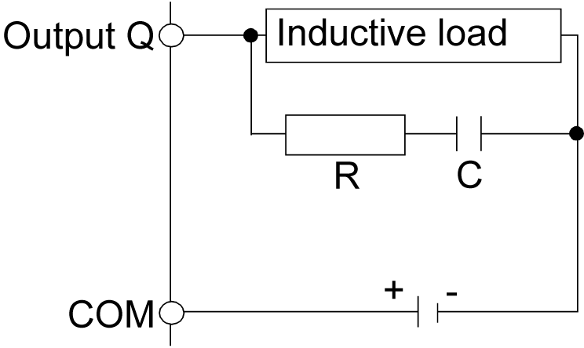
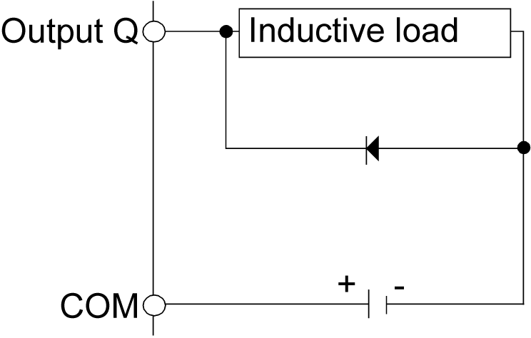
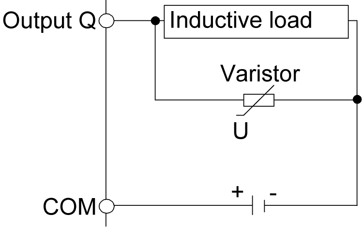

# Protecting Outputs from Inductive Load Damage

Protecting Outputs from Inductive Load Damage

Depending on the load, a protection circuit may be needed for the outputs on certain blocks. Inductive loads using DC voltages may create voltage reflections resulting in overshoot that will damage or shorten the life of output devices.

|  |
| --- |
| NOTICE |
| INOPERABLE EQUIPMENT |
| oBe sure that the actuators connected to the TM7 Digital I/O blocks have a built-in protective circuit to reduce the risk of inductive current load damage to the outputs.  oIf the actuators do not have built-in protection, use an appropriate, IP67 rated external protective circuit to reduce the risk of inductive current load damage to the outputs. |
| Failure to follow these instructions can result in equipment damage. |

NOTE: The following wiring diagrams are conceptual and are provided as non-definitive guidance for selecting an appropriate IP67 protective device.

Protective circuit A: this protection circuit can be used for DC load power circuits.

oC represents a value from 0.1 to 1 μF.

oR represents a resistor of approximately the same resistance value as the load.

Protective circuit B: this protection circuit can be used for DC load power circuits.

Use a diode with the following ratings:

oReverse withstand voltage: power voltage of the load circuit x 10.

oForward current: more than the load current.

Protective circuit C: this protection circuit can be used for DC load power circuits.

In applications where the inductive load is switched on and off frequently and/or rapidly, ensure that the continuous energy rating (J) of the varistor exceeds the peak load energy by 20% or more.