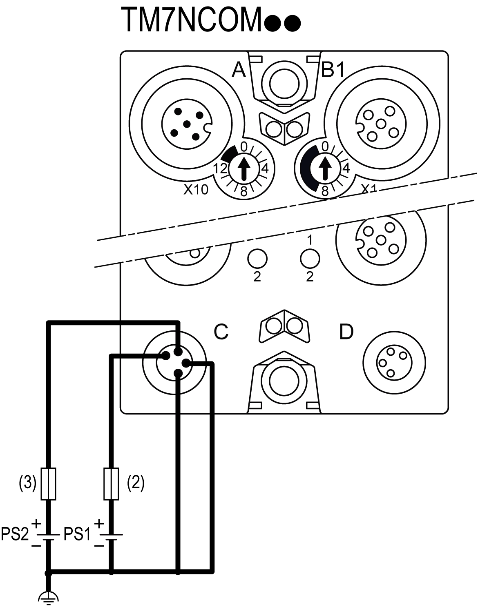

# Wiring the Field Bus Interface I/O Block

Wiring the Field Bus Interface I/O Block

The field bus interface I/O block is the beginning of the power distribution for the TM7 distributed configuration. Power is supplied by two external isolated power supplies depending on current needs and capabilities.

There are two power connections to be made to the field bus interface I/O block from your source power supplies:

| Connections | 2 Power Supplies |
| --- | --- |
| 24 Vdc main power that generates power for TM7 power bus | PS1 |
| 24 Vdc I/O power segment | PS2 |

The following figure shows a field bus interface I/O block wired with two separate external 24 Vdc power supplies:

(2)   External fuse, Type T slow-blow, 1 A, 250 V 1

(3)   External fuse, Type T slow-blow, 4 A maximum, 250 V

PS1   External isolated main power supply, 24 Vdc

PS2   External isolated I/O power supply, 24 Vdc

1 Fuse limited to 1 A per PDB, maximum fuse limited to 5 A with maximum 4 PDB interconnected. If less then 4 PDBs size the fuse in accordance with the number of PDBs.

NOTE: Connect the 0 Vdc power circuits together and to the functional ground (FE) of your system. If you do not interconnect the 0 Vdc circuits of the external power supplies, the status LEDs may not function correctly. In addition, there may potentially be more significant consequences such as an explosion and/or fire hazard.

|  |
| --- |
| Danger_Color.gifDANGER |
| POTENTIAL EXPLOSION OR FIRE |
| Always connect the 0 Vdc terminals of the external power supplies to the functional ground (FE) of your system. |
| Failure to follow these instructions will result in death or serious injury. |