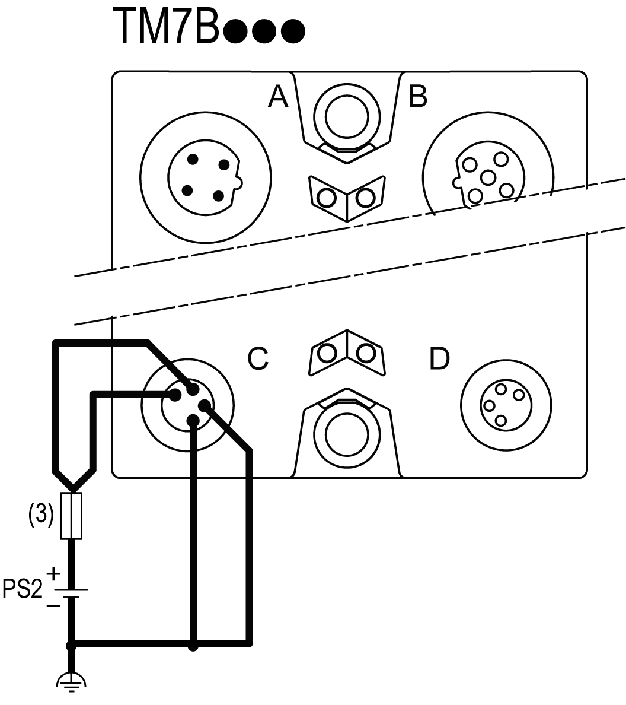

# Wiring the I/O Block

Wiring the I/O Block

When you provide power to a TM7 I/O block using the 24 VDC Power OUT connector of the preceding I/O block, both blocks occupy the same 24 Vdc I/O power segment. However, if you connect an external isolated power supply to the 24 Vdc Power IN connector of a TM7 I/O block, you establish a new 24 Vdc I/O power segment beginning with that I/O block.

When beginning a new 24 Vdc I/O power segment, select an external isolated power supply sufficient to the power requirements of the I/O blocks planned for that segment. For more information, refer to [24 Vdc I/O Power Segment Description](TM7_Part_-_Initial_Planning_for_TM7_System-5.htm#XREF_D_SE_0009310_1).

The following figure shows a I/O block wired with one external 24 Vdc power supply:

(3)   External fuse, Type T slow-blow, 8 A maximum, 250 V

PS2   External isolated I/O power supply, 24 Vdc

NOTE: Connect the 0 Vdc power circuits together and to the functional ground (FE) of your system. If you do not interconnect the 0 Vdc circuits of the external power supplies, the status LEDs may not function correctly. In addition, there may potentially be more significant consequences such as an explosion and/or fire hazard.

|  |
| --- |
| Danger_Color.gifDANGER |
| POTENTIAL EXPLOSION OR FIRE |
| Always connect the 0 Vdc terminals of the external power supplies to the functional ground (FE) of your system. |
| Failure to follow these instructions will result in death or serious injury. |