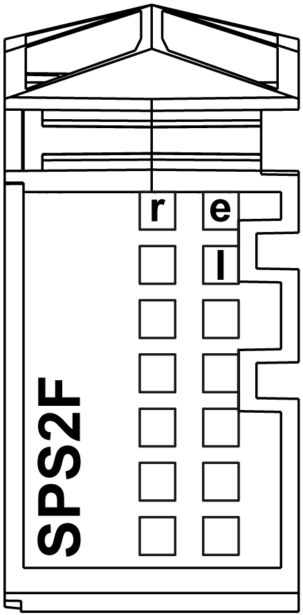

# Status LEDs

Status LEDs

The following figure shows the TM5SPS2F status LEDs:

The table below describes the TM5SPS2F status LEDs:

| LED | Color | Status | Description |
| --- | --- | --- | --- |
| r | Green | Off | Power supply not connected |
| Single flash | Reset state |
| Flashing | Preoperational state |
| On | RUN state |
| e | Red | Off | OK or module not connected |
| Double flash | Indicates one of the following conditions:  oTM5 power bus is overloaded.  o24 Vdc I/O power segment, via the external power supply or supplies, is too low.  oInput voltage for TM5 power bus, via the external power supply or supplies, is too low. |
| e+r | Steady red/single green flash | | Invalid firmware |
| l | Red | Off | TM5 power bus in the acceptable range |
| On | TM5 power bus is overloaded |