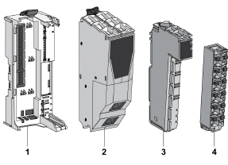

# Ordering Information

Ordering Information

The following figure and table provide the references to create a TM5 field bus interface with the TM5SPS3:

| Number | Reference | Description | Color |
| --- | --- | --- | --- |
| 1 | TM5ACBN1 | [Bus base for field bus interface module and Interface Power Distribution Module](../SPIG_TM5_TM7_-_Basics_of_the_TM5_System/SPIG_TM5_TM7_-_Basics_of_the_TM5_System-3.htm#XREF_D_SE_0015378_5) | White |
| 2 | TM5NS31 | Sercos [Bus Interface module](../SPIG_TM5_TM7_-_Basics_of_the_TM5_System/SPIG_TM5_TM7_-_Basics_of_the_TM5_System-3.htm#XREF_D_SE_0015378_9) | White |
| TM5NCO1 | [CANopen interface module](../SPIG_TM5_TM7_-_Basics_of_the_TM5_System/SPIG_TM5_TM7_-_Basics_of_the_TM5_System-3.htm#XREF_D_SE_0015378_9) | White |
| TM5NEIP1 | [EtherNet/IP interface](../SPIG_TM5_TM7_-_Basics_of_the_TM5_System/SPIG_TM5_TM7_-_Basics_of_the_TM5_System-3.htm#XREF_D_SE_0015378_9) | White |
| 3 | TM5SPS3 | [Interface Power Distribution Module (IPDM)](../SPIG_TM5_TM7_-_Basics_of_the_TM5_System/SPIG_TM5_TM7_-_Basics_of_the_TM5_System-3.htm#XREF_D_SE_0015378_6) | Grey |
| 4 | TM5ACTB12PS | [Terminal block for PDM, IPDM and receiver electronic module](../SPIG_TM5_TM7_-_Basics_of_the_TM5_System/SPIG_TM5_TM7_-_Basics_of_the_TM5_System-3.htm#XREF_D_SE_0015378_8) | Grey |

NOTE: For more information, refer to [TM5 Bus Bases and Terminal Blocks](../TM5_Bus_bases_and_Terminal_blocks/TM5_Bus_bases_and_Terminal_blocks-1.htm#XREF_D_SE_0004365_1).