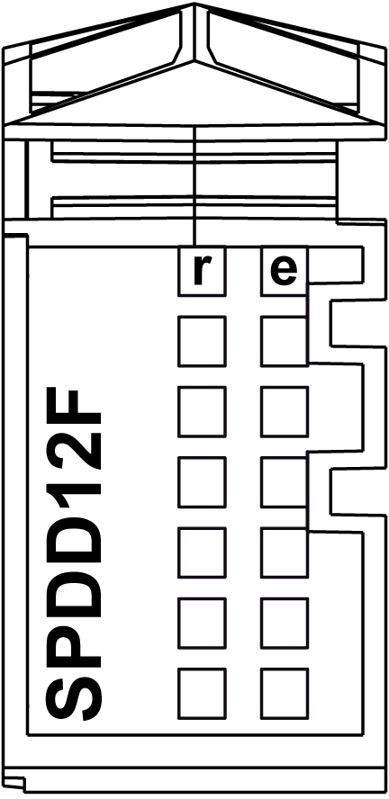

# Status LEDs

Status LEDs

The following figure shows the TM5SPDD12F status LEDs:

The table below describes the TM5SPDD12F status LEDs:

| LEDs | Color | Status | Description |
| --- | --- | --- | --- |
| r | Green | Off | Module supply not connected |
| Single flash | Reset state |
| Flashing | Preoperational state |
| On | RUN state |
| e | Red | Off | Ok or no power supply |
| On | Detected error or reset state |
| Single Flash | Fuse is blown or missing |
| e+r | Steady red / single green flash | | Invalid firmware |