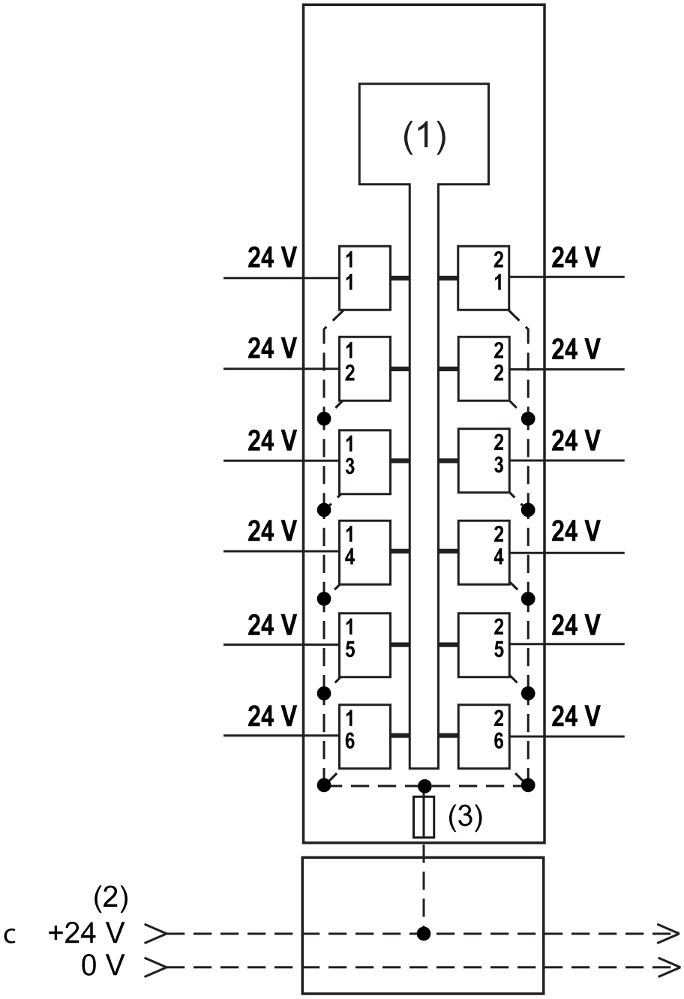
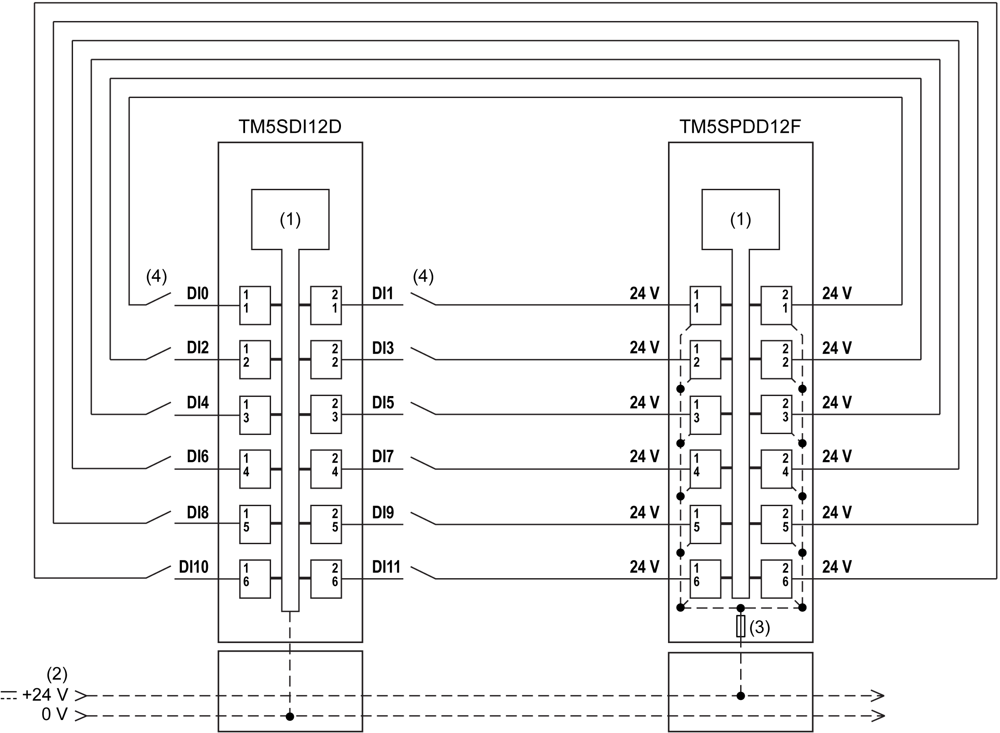

# Wiring Diagram

Wiring Diagram

The following figure shows the wiring diagram for the TM5SPDD12F:

1   Internal electronics

2   24 Vdc I/O power segment integrated into the bus bases

3   Integrated fuse type T slow-blow 6.3 A 250 V exchangeable

NOTE: I/O electronic modules and the field devices connected to them must all reside on the same 24 Vdc I/O power segment. If not, the status LEDs may not function correctly. In addition, there may potentially be more significant consequences such as an explosion and/or fire hazard.

|  |
| --- |
| Warning_Color.gifWARNING |
| POTENTIAL EXPLOSION OR FIRE |
| Connect the returns from the devices to the same power source as the 24 Vdc I/O power segment serving the module. |
| Failure to follow these instructions can result in death, serious injury, or equipment damage. |

The following figure shows the wiring diagram for the TM5SPDD12F with a TM5SDI12D:

1   Internal electronics

2   24 Vdc I/O power segment integrated into the bus bases

3   Integrated fuse type T slow-blow 6.3 A 250 V exchangeable

4   1-wire sensor

|  |
| --- |
| Warning_Color.gifWARNING |
| UNINTENDED EQUIPMENT OPERATION |
| Do not connect wires to unused terminals and/or terminals indicated as “No Connection (N.C.)”. |
| Failure to follow these instructions can result in death, serious injury, or equipment damage. |