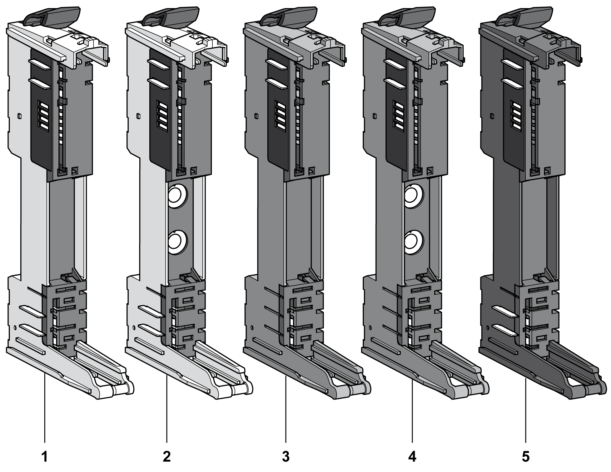

# Overview

Overview

The TM5 System bus bases are divided into different groups:

oTM5ACBM11 and TM5ACBM15 white bus bases are designed for 24 Vdc electronic modules.

oTM5ACBM01R and TM5ACBM05R gray bus bases are designed for Power Distribution Modules (PDM) and receiver modules.

oThe TM5ACBM12 black bus base is designed for input or output Alternative Current (AC) electronic modules.

The following figure shows the TM5 System bus bases:

| Number | Reference | Description | Color |
| --- | --- | --- | --- |
| 1 | TM5ACBM11 | Bus base 24 Vdc  24 Vdc I/O power segment pass-through | White |
| 2 | TM5ACBM15 | Bus base 24 Vdc  24 Vdc I/O power segment pass-through with [address setting](../TM5_-_Flexible_TM5_System_Installation/TM5_-_Flexible_TM5_System_Installation-12.htm#XREF_D_SE_0001880_1) | White |
| 3 | TM5ACBM01R | Bus base 24 Vdc for PDM and Receiver modules  24 Vdc I/O power segment left isolated | Gray |
| 4 | TM5ACBM05R | Bus base 24 Vdc for PDM and Receiver modules  24 Vdc I/O power segment left isolated with [address setting](../TM5_-_Flexible_TM5_System_Installation/TM5_-_Flexible_TM5_System_Installation-12.htm#XREF_D_SE_0001880_1) | Gray |
| 5 | TM5ACBM12 | Bus base for AC modules  24 Vdc I/O power segment pass through | Black |

NOTE: Electronic modules with relays for 30 Vdc / 230 Vac must be associated with TM5ACBM12 bus bases.

A slice must only be composed of a single color. For example, a gray bus base should only be assembled with a gray electronic module and a gray terminal block. However, color alone is not sufficient for compatibility; always confirm that functionality of slice components matches as well.

|  |
| --- |
| DangerElectrical_Color.gifDanger_Color.gifDANGER |
| INCOMPATIBLE COMPONENTS CAUSE ELECTRIC SHOCK OR ARC FLASH |
| oDo not associate components of a slice that have different colors.  oAlways confirm the compatibility of slice components and modules before installation using the association table in this manual.  oVerify that correct terminal blocks (minimally, matching colors and correct number of terminals) are installed on the appropriate electronic modules. |
| Failure to follow these instructions will result in death or serious injury. |