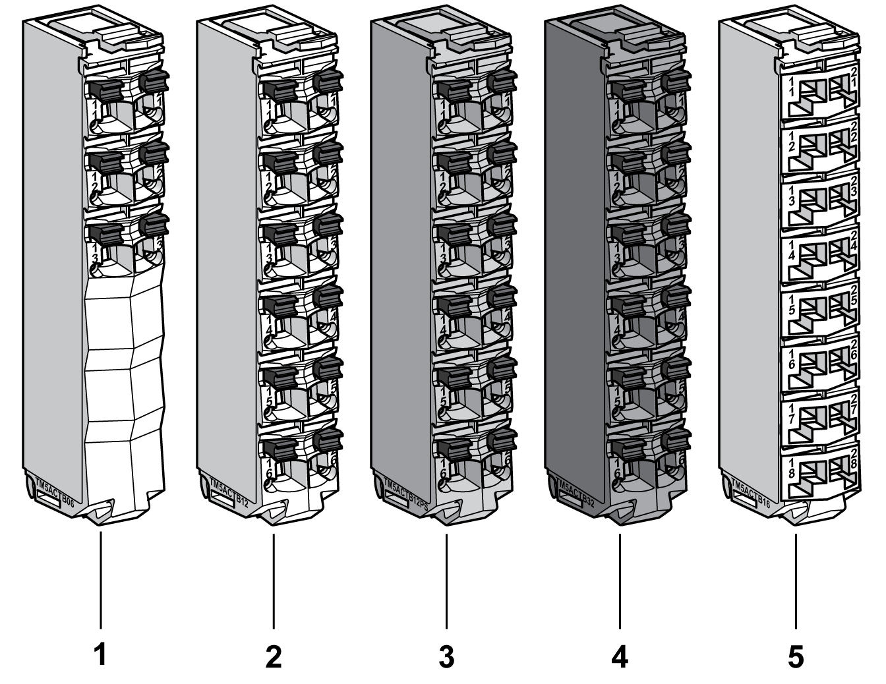

# Overview

Overview

The main features of the terminal blocks are:

oTool-free [wiring](../TM5_-_Initial_Planning_for_TM5/TM5_-_Initial_Planning_for_TM5-14.htm#XREF_D_SE_0018511_1) with spring clamp push-in technology

oSimple push-button wire release

oAbility to [label](../TM5_-_Flexible_TM5_System_Installation/TM5_-_Flexible_TM5_System_Installation-14.htm#XREF_D_SE_0001023_3) each terminal

o[Plain text labeling](../TM5_-_Flexible_TM5_System_Installation/TM5_-_Flexible_TM5_System_Installation-15.htm#XREF_D_SE_0001024_5) also possible

o[Test access](../TM5_-_Commissioning_and_Startup/TM5_-_Commissioning_and_Startup-2.htm#XREF_D_SE_0002456_4) for standard probes

oCan be [custom-coded](../TM5_-_Flexible_TM5_System_Installation/TM5_-_Flexible_TM5_System_Installation-13.htm#XREF_D_SE_0000888_1)

The following figure shows the TM5 System terminal blocks:

| Number | Reference | Description | Color |
| --- | --- | --- | --- |
| 1 | TM5ACTB06 | 6-pin terminal block designed for 24 Vdc I/O modules and TM5SBET1 Transmitter module. | White |
| 2 | TM5ACTB12 | 12-pin terminal block designed for 24 Vdc I/O modules, Common Distribution Modules (CDM) and Transmitter modules. | White |
| 3 | TM5ACTB12PS | 12-pin terminal block designed for 24 Vdc Power Distribution Modules (PDM), 24 Vdc Interface Power distribution Module (IPDM) and Receiver module. | Gray |
| 4 | TM5ACTB32 | 12-pin terminal block designed for AC and I/O relays modules. | Black |
| 5 | TM5ACTB16 | 16-pin terminal block designed for 24 Vdc I/O modules, Common Distribution Modules (CDM) and Transmitter modules. | White |

A slice must only be composed of a single color. For example, a gray bus base should only be assembled with a gray electronic module and a gray terminal block. However, color alone is not sufficient for compatibility; always confirm that functionality of slice components matches as well.

|  |
| --- |
| DangerElectrical_Color.gifDanger_Color.gifDANGER |
| INCOMPATIBLE COMPONENTS CAUSE ELECTRIC SHOCK OR ARC FLASH |
| oDo not associate components of a slice that have different colors.  oAlways confirm the compatibility of slice components and modules before installation using the association table in this manual.  oVerify that correct terminal blocks (minimally, matching colors and correct number of terminals) are installed on the appropriate electronic modules. |
| Failure to follow these instructions will result in death or serious injury. |