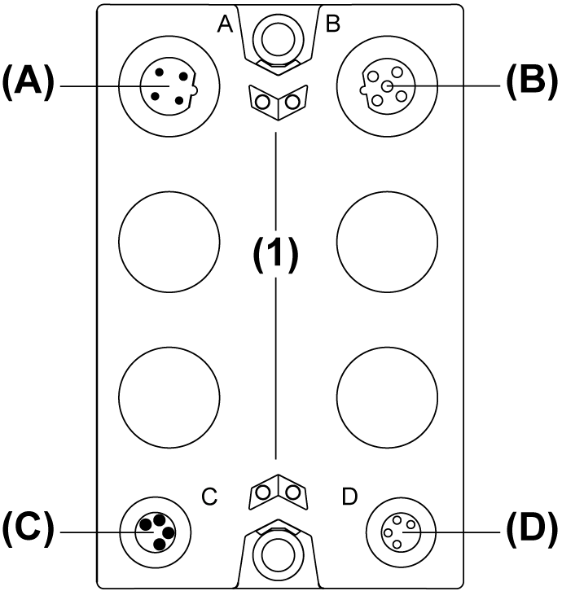

# Description

Description

The following figure illustrates the TM7SPS1A block:

(A)   TM7 bus IN connector

(B)   TM7 bus OUT connector

(C)   24 Vdc power IN connector

(D)   24 Vdc power OUT connector

(1)   Status LEDs

NOTE: Refer also to [Status LEDs](#XREF_D_SE_0009377_11).