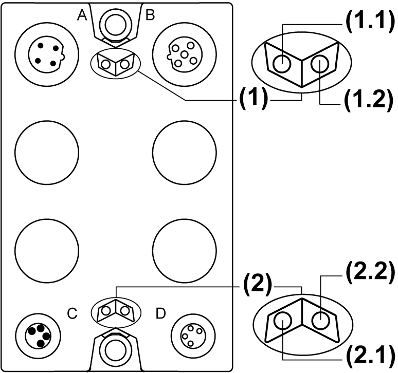

# Status LEDs

Status LEDs

The following figure illustrates the status LEDs of the TM7SPS1A block:

(1)   TM7 power bus status LEDs, set of two LEDs: 1.1 (green) and 1.2 (green)

(2)   Power status LEDs, set of two LEDs: 2.1 (orange) and 2.2 (orange)

The table below describes the TM7 power bus status LEDs of the TM7SPS1A block:

| TM7 power bus status LEDs | | Description |
| --- | --- | --- |
| LED 1.1 | LED 1.2 |
| OFF | OFF | No power supply on TM7 Bus, or detected error on TM7 Power bus |
| ON | ON | TM7 power supply is in valid range |

The table below describes the power status LEDs of the TM7SPS1A block:

| Power status LEDs | | Description |
| --- | --- | --- |
| LED 2.1 | LED 2.2 |
| OFF | OFF | No power supply, or power supply below the lower limit value |
| ON | ON | Power block supply is in valid range |