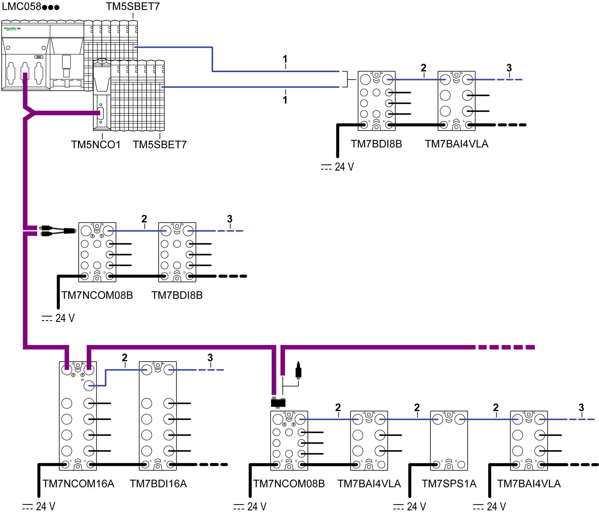

# Overview

Overview

The following figure shows expansion bus cables used in TM5/TM7 configurations:

1   Attachment IN cable: to connect a TM7 I/O block after a TM5 configuration using a TM5SBET7 transmitter module.

2   Drop cable: to build TM7 expansion bus between TM7 expansions blocks.

3   Attachment OUT cable: to connect a TM5 remote island after a TM7 I/O block using a TM5SBER2 receiver module.