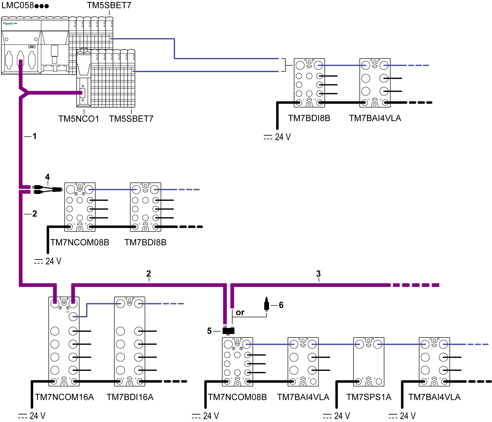

# Overview

Overview

The following figure shows an example of TM5/TM7 configuration using CANopen cables:

1   Attachment IN cable: to connect a TM7 CANopen interface I/O block to an IP20 configuration (controller, TM5 CANopen island, or other IP20 CANopen devices).

2   Drop cable: to build CAN bus between TM7 CANopen interface I/O blocks.

3   Attachment OUT cable: to connect a TM5 CANopen island or other IP20 CANopen device to a TM7 CANopen interface I/O block.

4   CAN bus Y cable

5   CAN bus Y connector

6   M12 CAN bus terminating resistor