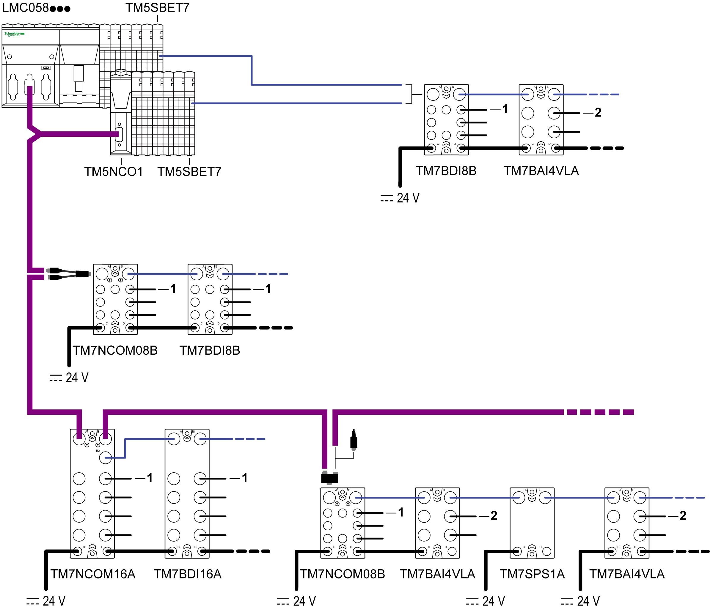

# Overview

Overview

The sensor cables are used to:

oConnect the sensors to the analog inputs of the TM7 I/O blocks

oConnect the actuators to the analog outputs of the TM7 I/O blocks

oConnect the fast digital signals to the fast inputs or outputs of the TM7 I/O blocks

The following figure shows sensor cables used in TM5/TM7 configurations:

1   Sensor cable for TM7 field bus interface I/O block and TM7 digital I/O block

2   Sensor cable for TM7 analog I/O block