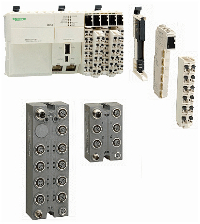

# TM5/TM7 System Planning and Installation Guide

TM5/TM7 System Planning and Installation Guide

TM5/TM7 System Planning and Installation Guide

This guide provides the information you will need in order to plan and install a TM5 / TM7 System.

This guide contains:

oAn overview and description of the TM5 / TM7 System,

oInformation and requirements to plan your installation,

oInstallation procedure of the TM5 / TM7 System,

oInformation for commissioning and diagnosing your installation.

EIO0000003161.01

© 2020 Schneider Electric. All rights reserved.