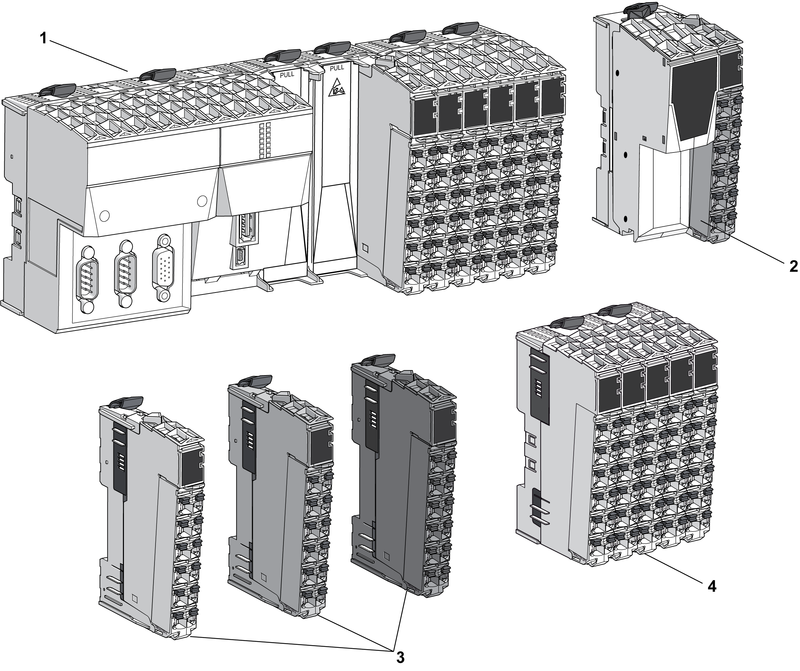

# Color Coding of the TM5 System

Color Coding of the TM5 System

Overview

The following figure shows colors of the TM5 components:

1   Controller

2   Field bus interface

3   Slices

4   Compact I/O

Controller Color Assignment

The color of all the [controllers](../glossary/glossary.htm#XREF_D_SE_0024697_661) and their removable terminal blocks is white.

Field Bus Interface Color Assignment

Two colors are used for the four components of a [field bus interface](../SPIG_TM5_TM7_-_Basics_of_the_TM5_System/SPIG_TM5_TM7_-_Basics_of_the_TM5_System-3.htm#XREF_D_SE_0015378_5):

oWhite for the:

ofield bus interface bus base and,

ofield bus interface module.

oGray for the:

oInterface Power Distribution Module (IPDM) and,

oassociated [terminal block](../glossary/glossary.htm#XREF_D_SE_0024697_420).

Slice Color Assignment

For modules other than the Compact I/O, an assembled TM5 module (referred to as a slice) is composed of a [bus base](../glossary/glossary.htm#XREF_D_SE_0024697_644), an [electronic module](../glossary/glossary.htm#XREF_D_SE_0024697_686), and a [terminal block](../glossary/glossary.htm#XREF_D_SE_0024697_420). Each [slice](../SPIG_TM5_TM7_-_Basics_of_the_TM5_System/SPIG_TM5_TM7_-_Basics_of_the_TM5_System-5.htm#XREF_D_SE_0015379_1) of the TM5 System is color coded for improved identification.

Different colors are used for the modules:

oWhite

oGray

oBlack

The color of a slice is defined by a combination of:

oInput or output voltage,

oFunctionality.

The following table gives the colors of the different types of slices:

| Voltage | Functionality | White | Gray | Black |
| --- | --- | --- | --- | --- |
| 24 Vdc | I/Os | X | – | – |
| Power distribution | – | X | – |
| TM5 bus transmission | X | – | – |
| TM5 bus reception | – | X | – |
| 100...240 Vac | I/Os | – | – | X |
| 24 Vdc / 230 Vac | Relay | – | – | X |

|  |
| --- |
| DangerElectrical_Color.gifDanger_Color.gifDANGER |
| INCOMPATIBLE COMPONENTS CAUSE ELECTRIC SHOCK OR ARC FLASH |
| oDo not associate components of a slice that have different colors.  oAlways confirm the compatibility of slice components and modules before installation using the association table in this manual.  oVerify that correct terminal blocks (minimally, matching colors and correct number of terminals) are installed on the appropriate electronic modules. |
| Failure to follow these instructions will result in death or serious injury. |

NOTE: Verify the compatibility of components with the [association table](../TM5_TM7_-_Tables/TM5_TM7_-_Tables-2.htm#XREF_D_SE_0000785_1) before installation.

Compact I/O Color Assignment

The color of the compact I/O and their removable terminal blocks is white.

EIO0000003161.01

© 2020 Schneider Electric. All rights reserved.