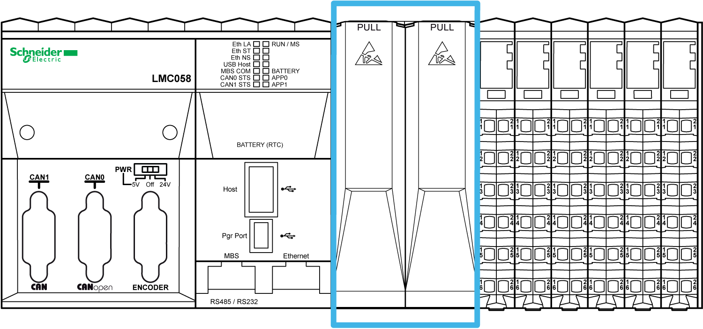
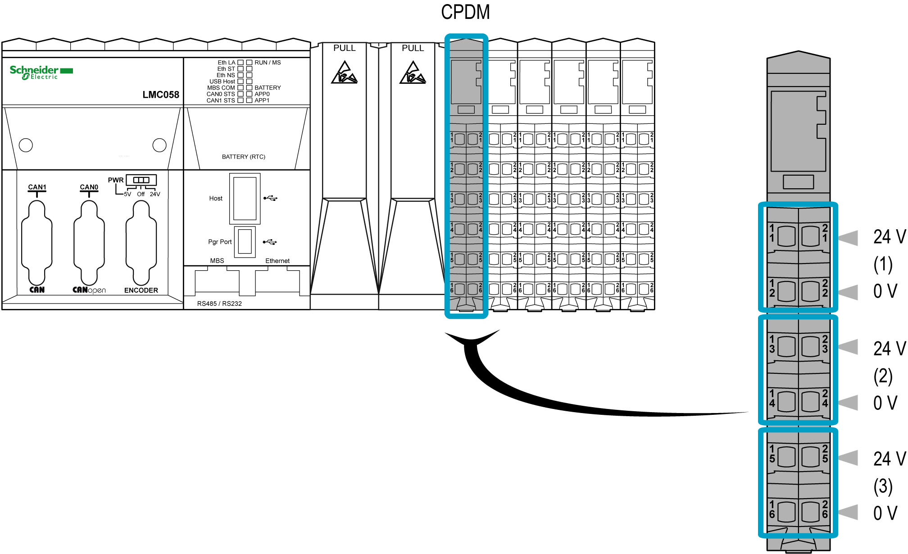

# Controller Description

Controller Description

Introduction

The [controller](../glossary/glossary.htm#XREF_D_SE_0024697_661) is the main [element](../glossary/glossary.htm#XREF_D_SE_0024697_725) of the TM5 System.

The families of controllers are:

oModicon M258 Logic Controller

oModicon LMC058 Motion Controller

The following graphic depicts a typical TM5 System with the LMC058 motion controller:

Modicon M258 Logic Controller

Mechanical, hardware, and [firmware](../../../../../../api/crossBook?lang=en-US&virtualBookName=glossary/glossary.htm#XREF_D_SE_0024697_707) features are described in the [Modicon M258 Hardware Guide](../../../tm5hw258&topicID=D_SE_0003145_7).

The following tables describes the controller references available for your TM5 System:

|  | PCI | CAN | USB A | USB Pgr | Eth | SL |
| --- | --- | --- | --- | --- | --- | --- |
| TM258LD42DT | 0 | 0 | 1 | 1 | 1 | 1 |
| TM258LD42DT4L | 2 | 0 | 1 | 1 | 1 | 1 |
| TM258LF42DT | 0 | 1 | 1 | 1 | 1 | 1 |
| TM258LF42DT4L | 2 | 1 | 1 | 1 | 1 | 1 |
| TM258LF66DT4L | 2 | 1 | 1 | 1 | 1 | 1 |
| TM258LF42DR | 2 | 1 | 1 | 1 | 1 | 1 |

|  | Embedded expert I/O | | | | Embedded regular I/O | | | | |
| --- | --- | --- | --- | --- | --- | --- | --- | --- | --- |
|  | Fast Inputs | Fast Outputs | Regular Inputs |  | Digital Inputs | Digital Outputs |  | Analog Inputs |
| TM258LD42DT | 2x | 5 | 2 | 2 | 1x | 12 | 12 | 0x | 0 |
| TM258LD42DT4L | 2x | 5 | 2 | 2 | 1x | 12 | 12 | 1x | 4 |
| TM258LF42DT | 2x | 5 | 2 | 2 | 1x | 12 | 12 | 0x | 0 |
| TM258LF42DT4L | 2x | 5 | 2 | 2 | 1x | 12 | 12 | 1x | 4 |
| TM258LF66DT4L | 2x | 5 | 2 | 2 | 2x | 12 | 12 | 1x | 4 |
| TM258LF42DR | 2x | 5 | 2 | 2 | 2x | 6 | 6 Relays | 0x | 0 |

Modicon LMC058 Motion Controller

Mechanical, hardware, and firmware features are described in the [Modicon LMC058 Hardware Guide](../../../../../../api/crossBook?lang=en-US&virtualBookName=tm5hwlmc&topicID=D_SE_0002286_7).

The following tables describe the controller references available for your TM5 System:

|  | PCI | CAN | USB A | USB Pgr | Eth | SL | ENC |
| --- | --- | --- | --- | --- | --- | --- | --- |
| LMC058LF42 | 0 | 2 | 1 | 1 | 1 | 1 | 1 |
| LMC058LF424 | 2 | 2 | 1 | 1 | 1 | 1 | 1 |

|  | Embedded expert I/O | | | | Embedded regular I/O | | | | |
| --- | --- | --- | --- | --- | --- | --- | --- | --- | --- |
|  | Fast Inputs | Fast Outputs | Regular Inputs |  | Digital Inputs | Digital Outputs |  | Analog Inputs |
| LMC058LF42 | 2x | 5 | 2 | 2 | 1x | 12 | 12 | 0x | 0 |
| LMC058LF424 | 2x | 5 | 2 | 2 | 1x | 12 | 12 | 1x | 4 |

M258 / LMC058 Controller Main Features

The following figure gives the main features of a controller:

1   Controller

2a   PCI slot with cover

2b   PCI slot with cover removed

3   Controller Power Distribution Module (CPDM)

4   Embedded expert I/Os

5   Embedded regular I/Os

PCI Slots

There are two [PCI](../glossary/glossary.htm#XREF_D_SE_0024697_341) slots to connect up to two interface modules depending on the controller reference.

The following figure shows the location of PCI slots of the controllers:

The PCI modules are used for specific application expansions of the controller. They are inserted in the PCI slots of the controller:

| Reference | Type | Description |
| --- | --- | --- |
| TM5PCRS2 | Serial line | TM5 interface electronic module, 1 [RS-232](../glossary/glossary.htm#XREF_D_SE_0024697_505), electrically isolated |
| TM5PCRS4 | Serial line | TM5 interface electronic module, 1 [RS-485](../glossary/glossary.htm#XREF_D_SE_0024697_506), electrically isolated |
| TM5PCDPS | [Profibus DP](../glossary/glossary.htm#XREF_D_SE_0024697_522) | TM5 interface electronic module, 1 [RS-485](../glossary/glossary.htm#XREF_D_SE_0024697_506), electrically isolated |

For more details refer to the [Modicon TM5 PCI Modules Hardware Guide](../../../../../../api/crossBook?lang=en-US&virtualBookName=tm5pcihw&topicID=D_SE_0002702_16).

|  |
| --- |
| NOTICE |
| ELECTROSTATIC DISCHARGE |
| oVerify that empty PCI slots have their covers in place before applying power to the controller.  oNever touch an exposed PCI connector. |
| Failure to follow these instructions can result in equipment damage. |

Controller Power Distribution Module (CPDM)

The distribution of power by the [CDPM](../glossary/glossary.htm#XREF_D_SE_0024697_663) consists of three dedicated electrical circuits:

| Designation | Description |
| --- | --- |
| 24 Vdc embedded expert modules power | 24 Vdc power that serves the embedded expert I/O modules of the controller and the [encoder](../glossary/glossary.htm#XREF_D_SE_0024697_689) (depends on references) |
| 24 Vdc Main power | 24 Vdc power that serves the electronics of the controller and generates independent power for:  oPCI communication modules (depends on references),  oModbus connected devices,  oUSB keys,  oElectronics of the embedded regular I/O,  oTM5 power bus that serves the expansion modules. |
| 24 Vdc I/O power segment | The 24 Vdc power that serves:  othe embedded regular I/O,  othe sensors and actuators connected to the embedded regular I/O,  othe expansion modules,  othe sensors and actuators connected to the expansion modules,  othe external devices connected to the Common Distribution Modules (CDM). |

The following figure shows the terminal block assignments of the CPDM:

1   24 Vdc embedded expert modules power

2   24 Vdc Main power

3   24 Vdc I/O power segment

Embedded Expert I/Os

The following figure shows the location of the expert I/Os of the controller:

The controllers have two embedded expert I/O groups. Each group contains:

o5 [fast inputs](../glossary/glossary.htm#XREF_D_SE_0024697_699)

o2 regular inputs

o2 [fast outputs](../glossary/glossary.htm#XREF_D_SE_0024697_699)

Each group can be configured as:

o1 to 4 simple High Speed Counters (HSC)

o1 main [HSC](../glossary/glossary.htm#XREF_D_SE_0024697_574)

o1 Pulse Width Modulated ([PWM](../glossary/glossary.htm#XREF_D_SE_0024697_503)) output

o1 frequency generator

o1 encoder interface

Fast inputs resolution is up to 200 kHz.

NOTE: When a fast input is not used by special function, it can be used as a regular input.

Fast outputs resolution is up to 100 kHz.

NOTE: When a fast output is not used by special function, it can be used as a regular output.

Embedded Regular I/Os

The following figure shows the location of the embedded regular I/Os of the controller:

The following table gives a short description of the different regular I/Os embedded in the controller, depending on the controller reference:

| Regular I/Os | Short Description |
| --- | --- |
| [Digital Inputs](../glossary/glossary.htm#XREF_D_SE_0024697_674) | 24 Vdc [sink](../glossary/glossary.htm#XREF_D_SE_0024697_376) / 1 or 2 wires / input Type 1 |
| [Digital Outputs](../glossary/glossary.htm#XREF_D_SE_0024697_674) | 24 Vdc [source](../glossary/glossary.htm#XREF_D_SE_0024697_409) / 1 wire / transistor / 0.5 A |
| [Analog Inputs](../glossary/glossary.htm#XREF_D_SE_0024697_624) | 12 bit resolution / -10...+10 Vdc / 0...20 mA / 4...20 mA |
| Relay Outputs | 2 A / 30 Vdc / 240 Vac |

EIO0000003161.01

© 2020 Schneider Electric. All rights reserved.