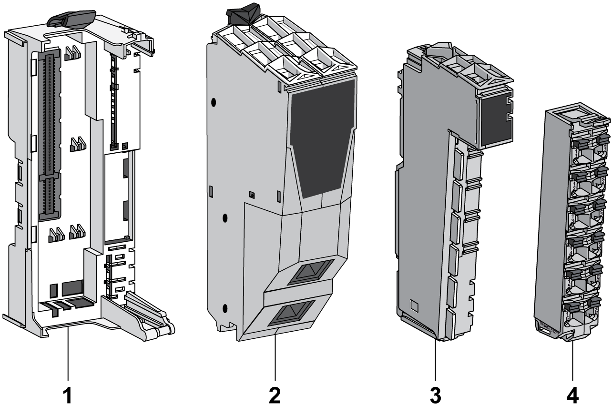
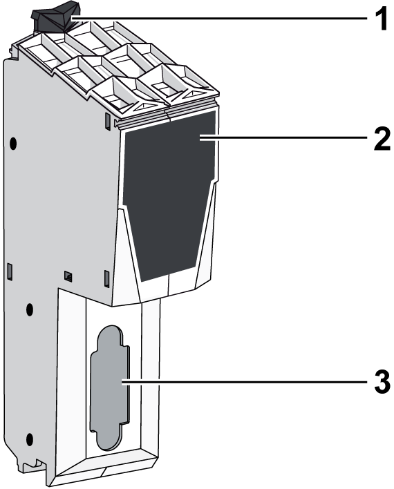

# Field Bus Interface Description

Field Bus Interface Description

Introduction

The TM5 field bus interface is the first element of the [TM5 distributed I/O island](../Intro_-_Description_of_the_TM5_and_TM7_System/Intro_-_Description_of_the_TM5_and_TM7_System-3.htm#XREF_D_SE_0009280_3).

The following figure shows the location of the TM5 field bus interface in a distributed I/O island:

Field Bus Interface Overview

The TM5 field bus interface with built-in power distribution is composed of four different parts that can either be ordered together as a kit, or can be ordered separately as shown below:

| Item | Description |
| --- | --- |
| 1 | Field bus interface bus base |
| 2 | Field bus interface module |
| 3 | Interface Power Distribution Module [(IPDM)](#XREF_D_SE_0015378_6) |
| 4 | [Terminal block](#XREF_D_SE_0015378_8) |

Field Bus Interface Bus Base Description

The following figure shows the different parts of the field bus interface bus base:

1   Locking lever

2   DIN rail locking mechanism

3   DIN rail contact

4   Guides for assembly of the IPDM

5   Rotation axle for terminal block

6   TM5 bus power contacts

7   TM5 bus data contacts

8   24 Vdc I/O power segment contacts

9   Interlocking guides

10   Slot for bus interface module

The following table gives the available reference:

| Reference | Field Bus Interface Bus Base Description | Color |
| --- | --- | --- |
| TM5ACBN1 | Bus base for field bus interface module and Interface Power Distribution Module [(IPDM)](#XREF_D_SE_0015378_6) | White |

Field Bus Interface Module Description

The following figure shows the front view of the field bus interface module:

1   Locking clip

2   Front view

3   Field bus connector

The following table gives the available reference:

| Reference | Field Bus Interface Module Description | Color |
| --- | --- | --- |
| TM5NCO1 | CANopen interface module | White |
| TM5NS31 | [Sercos](../glossary/glossary.htm#XREF_D_SE_0024697_593) interface module | White |
| TM5NEIP1 | EtherNet/IP interface | White |

NOTE: The compatibilities of the field buses are described in the EcoStruxure Machine Expert Compatiblity and Migration - User Guide.

Interface Power Distribution Module (IPDM)

The following table gives the available reference:

| Reference | [IPDM Description](SPIG_TM5_TM7_-_Basics_of_the_TM5_System-5.htm#XREF_D_SE_0015379_6) | Color |
| --- | --- | --- |
| TM5SPS3 | Bus interface 24 Vdc power supply | Gray |

The distribution of the power by the IPDM consists of two dedicated electrical circuits:

| Designation: | Description: |
| --- | --- |
| 24 Vdc Main power | 24 Vdc power that serves the electronics of the bus Interface Module and generates independent power for the TM5 power bus that serves the expansion modules. |
| 24 Vdc I/O power segment | The 24 Vdc power that serves:  othe expansion modules,  othe sensors and actuators connected to the expansion modules,  othe external devices connected to the Common Distribution Modules (CDM). |

Terminal Block Description

The following table gives the available reference:

| Reference | [Terminal Block Description](SPIG_TM5_TM7_-_Basics_of_the_TM5_System-5.htm#XREF_D_SE_0015379_7) | Color |
| --- | --- | --- |
| TM5ACTB12PS | [24 Vdc, 12-pin terminal block for PDM, IPDM and Receiver electronic module](../TM5_Bus_bases_and_Terminal_blocks/TM5_Bus_bases_and_Terminal_blocks-3.htm#XREF_D_SE_0015419_1) | Gray |

The following figure shows the terminal block assignments of the IPDM:

(1)   24 Vdc Main power

(2)   24 Vdc I/O power segment

EIO0000003161.01

© 2020 Schneider Electric. All rights reserved.