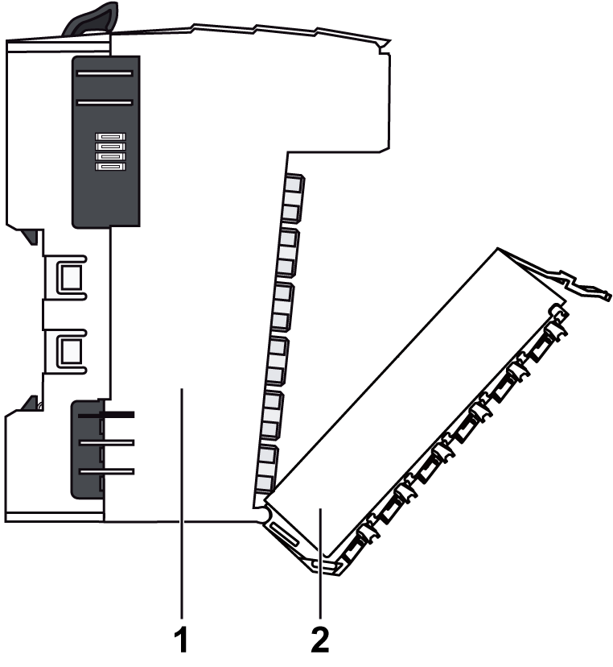
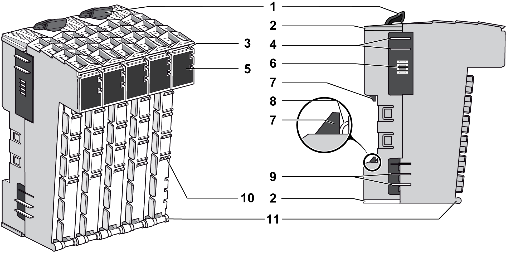

# Compact I/O Description

Compact I/O Description

Introduction

The TM5 Compact I/O are I/O expansion modules for your TM5 system. The compact I/O module is a group of TM5 electronic I/O modules under a single reference. The individual electronic modules are identified by an abbreviated designation on their front face, while the reference of the entire group can be found on the side of the [compact I/O module](../glossary/glossary.htm#XREF_D_SE_0024697_658). The abbreviated designation on the individual module faces corresponds to the last characters of the individual module references.The terminals blocks are assembled on the compact I/O when delivered.

The compact I/O uses a single address on the TM5 Bus.

The electronic modules included in the compact I/O are not individually replaceable.

NOTE: Unlike the individual TM5 digital and analog I/O electronic modules, the compact I/O do not have hot-swap capability. Do not attempt to hot swap these modules.

|  |
| --- |
| Warning_Color.gifWARNING |
| UNINTENDED EQUIPMENT OPERATION |
| Do not attempt to hot swap TM5 Compact I/O. |
| Failure to follow these instructions can result in death, serious injury, or equipment damage. |

The following figure shows a TM5 Compact I/O as the second component of a remote island:

Compact I/O

The range of compact I/O includes:

odigital input electronic modules

odigital output electronic modules

o[analog input](../glossary/glossary.htm#XREF_D_SE_0024697_624) electronic modules

o[analog output](../glossary/glossary.htm#XREF_D_SE_0024697_625) electronic modules

Every electronic module channel has a status LED.

Mechanical and hardware features are described in the [Modicon TM5 Compact I/O Modules Hardware Guide](../../../../../../api/crossBook?lang=en-US&virtualBookName=tm5comhw&topicID=D_SE_0009768_15).

The following table describes the compact I/O reference available for your TM5 System:

| Reference | Number and Channel Type | | | | | | | |
| --- | --- | --- | --- | --- | --- | --- | --- | --- |
| Digital Inputs | | Digital Outputs | | Analog Inputs | | Analog Outputs | |
| TM5C24D18T | 2x12In | 24 | 3x6Out | 18 | – | 0 | – | 0 |
| TM5C12D8T | 3x4In | 12 | 2x4Out | 8 | – | 0 | – | 0 |
| TM5C24D12R | 2x12In | 24 | 2x6Rel | 12 | – | 0 | – | 0 |
| TM5CAI8O8VL | – | 0 | – | 0 | 2x4AI ±10 V | 8 | 2x4AO ±10 V | 8 |
| TM5CAI8O8CL | – | 0 | – | 0 | 2x4AI 0-20 mA / 4-20 mA | 8 | 2x4AO 0-20 mA | 8 |
| TM5CAI8O8CVL | – | 0 | – | 0 | 1x4AI ±10 V | 4 | 1x4AO ±10 V | 4 |
| 1x4AI 0-20 mA / 4-20 mA | 4 | 1x4AO 0-20 mA | 4 |
| TM5C12D6T6L | 2x6In | 12 | 1x6Out | 6 | 1x4AI ±10 V / 0-20 mA / 4-20 mA | 4 | 1x2AO ±10 V / 0-20 mA | 2 |

Compact I/O Physical Description

The individual electronic modules included in a compact I/O are not replaceable and the terminals blocks are delivered assembled on the compact I/O.

1   Integrated bus base and electronic modules of the compact I/O (inseparable)

2   Terminal blocks

|  |
| --- |
| NOTICE |
| ELECTROSTATIC DISCHARGE |
| oNever touch the contacts of the electronic module.  oAlways keep the connector in place during normal operation. |
| Failure to follow these instructions can result in equipment damage. |

The following figure shows the physical description of the bus base and electronic modules of the compact I/O:

1   Locking levers

2   Interlocking guides

3   Slot for labeling

4   TM5 bus power contacts

5   Display (LEDs)

6   TM5 bus data contacts

7   DIN rail locking mechanism

8   DIN rail contact

9   24 Vdc I/O power contacts

10   Slot to code the electronic module with the associated terminal block

11   Rotation axle for terminal block

NOTE: The [terminal blocks](SPIG_TM5_TM7_-_Basics_of_the_TM5_System-5.htm#XREF_D_SE_0015379_7) associated to the compact I/O are 12-pin white terminal blocks.

Inputs and Outputs Modules Features

The following table gives a short description of the input and output modules of the compact I/Os:

| I/Os Type | Short Description |
| --- | --- |
| Digital Inputs | 24 Vdc / 3.75 mA / sink / 1, 2 or 3 wires |
| Digital Outputs | 24 Vdc / 0.5 A / source / 2 or 3 wires |
| Analog Inputs | 12 bit resolution / –10...+10 Vdc / 0...10 Vdc/ 0...20 mA / 4...20 mA |
| Analog Output | 12 bit resolution / –10...+10 Vdc / 0...10 Vdc/ 0...20 mA |
| Relay Outputs | 2 A / 30 Vdc / 240 Vac |

EIO0000003161.01

© 2020 Schneider Electric. All rights reserved.