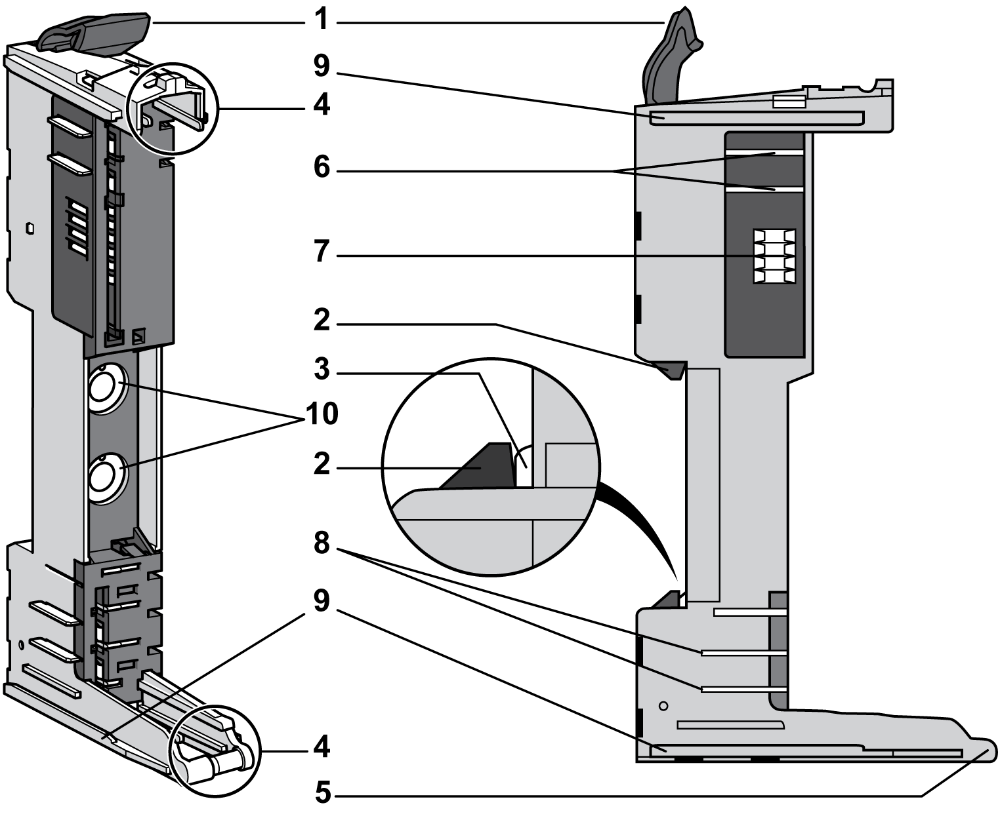
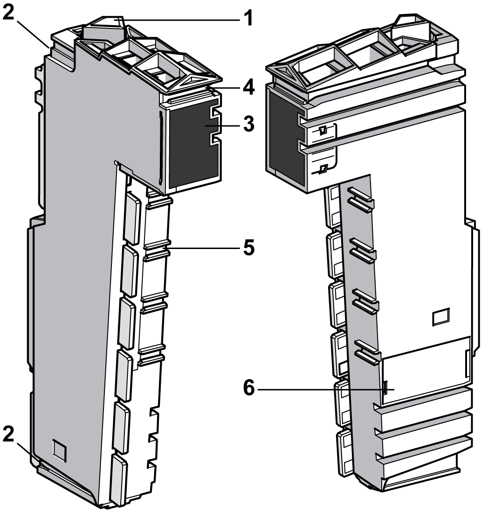

# Slice Description

Slice Description

Overview

A slice is an expansion module that has one of the following functions in the TM5 System:

oExpansion I/Os or

oPower distribution or

oCommon distribution or

oExpansion bus

The following figure shows the three components of a slice:

1   Bus base

2   Electronic module

3   Terminal block

|  |
| --- |
| DangerElectrical_Color.gifDanger_Color.gifDANGER |
| INCOMPATIBLE COMPONENTS CAUSE ELECTRIC SHOCK OR ARC FLASH |
| oDo not associate components of a slice that have different colors.  oAlways confirm the compatibility of slice components and modules before installation using the association table in this manual.  oVerify that correct terminal blocks (minimally, matching colors and correct number of terminals) are installed on the appropriate electronic modules. |
| Failure to follow these instructions will result in death or serious injury. |

The [bus base](../glossary/glossary.htm#XREF_D_SE_0024697_644) and the terminal block for the [electronic module](../glossary/glossary.htm#XREF_D_SE_0024697_686), must be ordered separately. For the references see respective sections below.

When assembled the three components form an integral unit that resists vibration and electrostatic discharge.

|  |
| --- |
| NOTICE |
| ELECTROSTATIC DISCHARGE |
| oNever touch the contacts of the electronic module.  oAlways keep the connector in place during normal operation. |
| Failure to follow these instructions can result in equipment damage. |

The [compatibility table](../TM5_TM7_-_Tables/TM5_TM7_-_Tables-2.htm#XREF_D_SE_0000785_2) gives the possible associations between components of a slice.

Bus Base Description

The following figures shows the different parts of the bus base:

1   Locking lever

2   DIN rail locking mechanism

3   DIN rail contact

4   Guides for assembly of the electronic module

5   Rotation axle for terminal block

6   TM5 bus power contacts

7   TM5 bus data contacts

8   24 Vdc I/O power segment contacts

9   Interlocking guides

10   Address setting rotary switches (optional, depending on references)

This table gives the different types of [bus bases](../TM5_Bus_bases_and_Terminal_blocks/TM5_Bus_bases_and_Terminal_blocks-2.htm#XREF_D_SE_0015418_1):

| Reference | Bus Base Description | Color |
| --- | --- | --- |
| TM5ACBM11 | Bus base 24 Vdc  24 Vdc I/O power segment pass-through | White |
| TM5ACBM15 | Bus base 24 Vdc  24 Vdc I/O power segment pass-through with address setting | White |
| TM5ACBM01R | Bus base 24 Vdc for PDM and Receiver modules  24 Vdc I/O power segment left isolated | Gray |
| TM5ACBM05R | Bus base 24 Vdc for PDM and Receiver modules  24 Vdc I/O power segment left isolated with address setting | Gray |
| TM5ACBM12 | Bus base for AC modules  24 Vdc I/O power segment pass-through | Black |

Electronic Module Description

The following figure shows the different parts of the electronic modules:

1   Locking lever

2   Guides for assembly

3   Display (LEDs)

4   Slot for labeling

5   Slot to code the electronic module and the associated terminal block

6   Internal fuse exchangeable (depending on references)

This table presents the different types of electronic modules:

| Reference | Electronic Module Description | Color | Refer to |
| --- | --- | --- | --- |
| TM5SD•• | Digital modules | White or black | [Modicon TM5 Digital I/O Modules Hardware Guide](../../../../../../api/crossBook?lang=en-US&virtualBookName=tm5diohw&topicID=D_SE_0001185_12) |
| TM5SA•• | Analog modules | White | [Modicon TM5 Analog I/O Modules Hardware Guide](../../../../../../api/crossBook?lang=en-US&virtualBookName=tm5aiohw&topicID=D_SE_0001184_15) |
| TM5SPS1• | Power Distribution Modules (PDM) | Gray | [TM5 Power Distribution Modules](../TM5xxx_Power_Distribution_Module/TM5xxx_Power_Distribution_Module-1.htm#XREF_D_SE_0004364_1) |
| TM5SPS2• |
| TM5SPS3 | Interface Power Distribution Module (IPDM) | Gray | [TM5 Interface Power Distribution Module IPDM](../TM5SPS3/TM5SPS3-1.htm#XREF_D_SE_0009141_1) |
| TM5SE•• | Expert modules | White | [Modicon TM5 Expert (High Speed Counter) Modules Hardware Guide](../../../../../../api/crossBook?lang=en-US&virtualBookName=tm5exphw&topicID=D_SE_0002180_15) |
| TM5SBET•• | Transmitter modules | White | [Modicon TM5 Transmitter and Receiver Modules Hardware Guide](../../../../../../api/crossBook?lang=en-US&virtualBookName=tm5bushw&topicID=D_SE_0003232_9) |
| TM5SBER•• | Receiver module | Gray |
| TM5SPD•• | Common Distribution Modules (CDM) | White | [TM5 Common Distribution Modules](../TM5xxx_Common_Distribution_Module/TM5xxx_Common_Distribution_Module-1.htm#XREF_D_SE_0004413_1) |
| TM5SD000 | Dummy module | White | [TM5 Accessories Modules](../TM5_Accessories_Modules/TM5_Accessories_Modules.htm#XREF_D_SE_0004410_1) |

Terminal Block Description

The main features of the terminal block are:

oTool-free wiring with spring clamp push-in technology

oPush-button wire release

oAbility to [label](../TM5_-_Flexible_TM5_System_Installation/TM5_-_Flexible_TM5_System_Installation-14.htm#XREF_D_SE_0001023_3) each terminal

o[Plain text labeling](../TM5_-_Flexible_TM5_System_Installation/TM5_-_Flexible_TM5_System_Installation-15.htm#XREF_D_SE_0001024_5) also possible

o[Test access](../TM5_-_Commissioning_and_Startup/TM5_-_Commissioning_and_Startup-2.htm#XREF_D_SE_0002456_4) for standard probes

oCan be [custom-coded](../TM5_-_Flexible_TM5_System_Installation/TM5_-_Flexible_TM5_System_Installation-13.htm#XREF_D_SE_0000888_1)

The following figure shows the different parts of the terminal block:

1   Wire release push-button

2   Pin assignment

3   Spring clamp connector

4   Test access point

5   Hinge for the axle on the bus base

6   Latch for the electronic module

7   Back slot for coding

8   Front slot for labeling

9   Slot for cable tie

This table gives the different types of [terminal blocks](../TM5_Bus_bases_and_Terminal_blocks/TM5_Bus_bases_and_Terminal_blocks-3.htm#XREF_D_SE_0015419_1):

| Reference | Terminal Block Description | Color |
| --- | --- | --- |
| TM5ACTB06 | 24 Vdc, 6-pin terminal block | White |
| TM5ACTB12 | 24 Vdc, 12-pin terminal block | White |
| TM5ACTB12PS | 24 Vdc, 12-pin terminal block for PDM, IPDM and Receiver electronic module | Gray |
| TM5ACTB16 | 24 Vdc, 16-pin terminal block | White |
| TM5ACTB32 | 240 Vac, 12-pin terminal block | Black |

EIO0000003161.01

© 2020 Schneider Electric. All rights reserved.