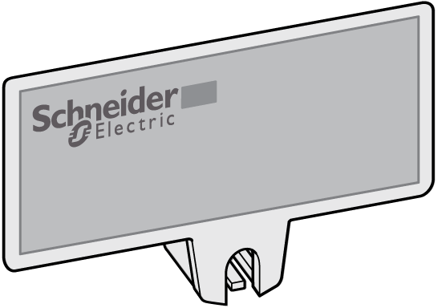

# Accessories for the TM7 System

Accessories for the TM7 System

Overview

The TM7 accessories include the following:

ouseable with all expansion blocks:

oM8 and M12 sealing plugs,

osupport for block label,

oexpansion bus, power distribution and sensor cables,

otorque wrench.

ouseable with analog temperature input blocks only:

oM12 thermocouple plug.

ouseable with the smaller expansion block:

oDIN rail mounting plate

ouseable with field bus interface I/O blocks only:

oCAN bus Y connector,

oCAN Y cable

oCAN bus cables,

oCAN bus terminating resistor.

DIN Rail Mounting Plate

The following accessory is used to install blocks onto a 35 mm [DIN Rail](../TM7_-_TM7_System_Installation/TM7_-_TM7_System_Installation-3.htm#XREF_D_SE_0010003_19):

| Reference | Description | Description |
| --- | --- | --- |
| TM7ACMP | Mounting plate on DIN rail | G-SE-0007244.1.jpg |

NOTE: Only small (Size 1) blocks can be installed on DIN rail with the TM7ACMP mounting plate.

Support For Block Label

The support for block labels allows [labeling the blocks](../TM7_-_TM7_System_Installation/TM7_-_TM7_System_Installation-3.htm#XREF_D_SE_0010003_24):

M12 CAN Bus Terminating Resistor

The M12 CAN bus terminating resistor is connected on the last field bus interface I/O block of the CANopen [network](../glossary/glossary.htm#XREF_D_SE_0024697_152). It is connected:

oto the accessory TM7ACYC• for a TM7NCOM08B.

oto the field bus OUT connector for a TM7NCOM16A or TM7NCOM16B.

| Reference | Description | |
| --- | --- | --- |
| TM7ACTLA | M12 CAN bus terminating resistor | G-SE-0007246.1.jpg |

M12 Thermocouple Plug

The [M12 thermocouple plug](../../../../../../api/crossBook?lang=en-US&virtualBookName=tm7aiohw&topicID=D_SE_0008033_13) is used for compensation of the temperature at measurement points:

| Reference | Description | |
| --- | --- | --- |
| TM7ACTHA | M12 thermocouple plug | G-SE-0007209.1.gif |

M8 and M12 Sealing Plug

The following table presents the references of the sealing plugs for unused M8 and M12 connectors:

| Reference | Description | |
| --- | --- | --- |
| TM7ACCB | M8 Sealing plug | G-SE-0007249.1.gif |
| TM7ACCA | M12 Sealing plug |

CAN Bus Y Cable

The CAN bus Y cable is used to connect the TM7NCOM08B in a CANopen network:

| Reference | Description | |
| --- | --- | --- |
| TM7ACYCJ | CAN bus Y cable | G-SE-0007247.1.jpg |

CAN Bus Y Connector

The CAN bus Y connector is used to connect the TM7NCOM08B in a CANopen network:

| Reference | Description | |
| --- | --- | --- |
| TM7ACYC | CAN bus Y connector | G-SE-0007248.1.jpg |

TM7 Cables

The connections for TM7 System are designed as circular plugs. The following types of pre-assembled cables are required to connect and build the TM7 System:

o[Expansion bus cables](../TM7_Cables/TM7_Cables-2.htm#XREF_D_SE_0009660_1)

o[CANopen cables](../TM7_Cables/TM7_Cables-3.htm#XREF_D_SE_0009907_1)

o[Power cables](../TM7_Cables/TM7_Cables-4.htm#XREF_D_SE_0009908_1)

o[Sensor cables](../TM7_Cables/TM7_Cables-5.htm#XREF_D_SE_0009909_1)

Torque Wrench

Two torque wrenches (M8 and M12) are available as accessories to help you mount and fasten the [TM7 cables](../TM7_-_TM7_System_Installation/TM7_-_TM7_System_Installation-3.htm#XREF_D_SE_0010003_22).

Each torque wrench has a screwdriver-type handle and a 4 mm (0.16 in.) hexagonal drive shaft. The torque of the drive shaft is preset and cannot be adjusted. The bit mounted on the drive shaft is appropriately sized for either an M8 or M12 plug:

| Reference | Description | |
| --- | --- | --- |
| TM7ACTW | Torque wrench with preset torque of 0.2 Nm (1.8 lbf-in) for M8 size plug | G-SE-0007829.1.jpg |
| Torque wrench with preset torque of 0.4 Nm (3.5 lbf-in) for M12 size plug | G-SE-0007829.1_1.jpg |

EIO0000003161.01

© 2020 Schneider Electric. All rights reserved.