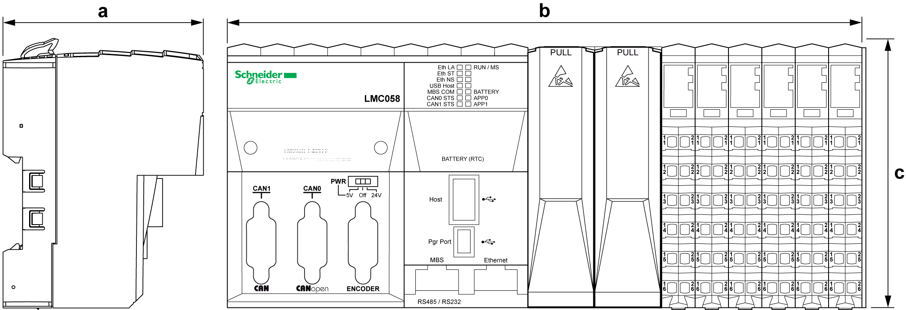
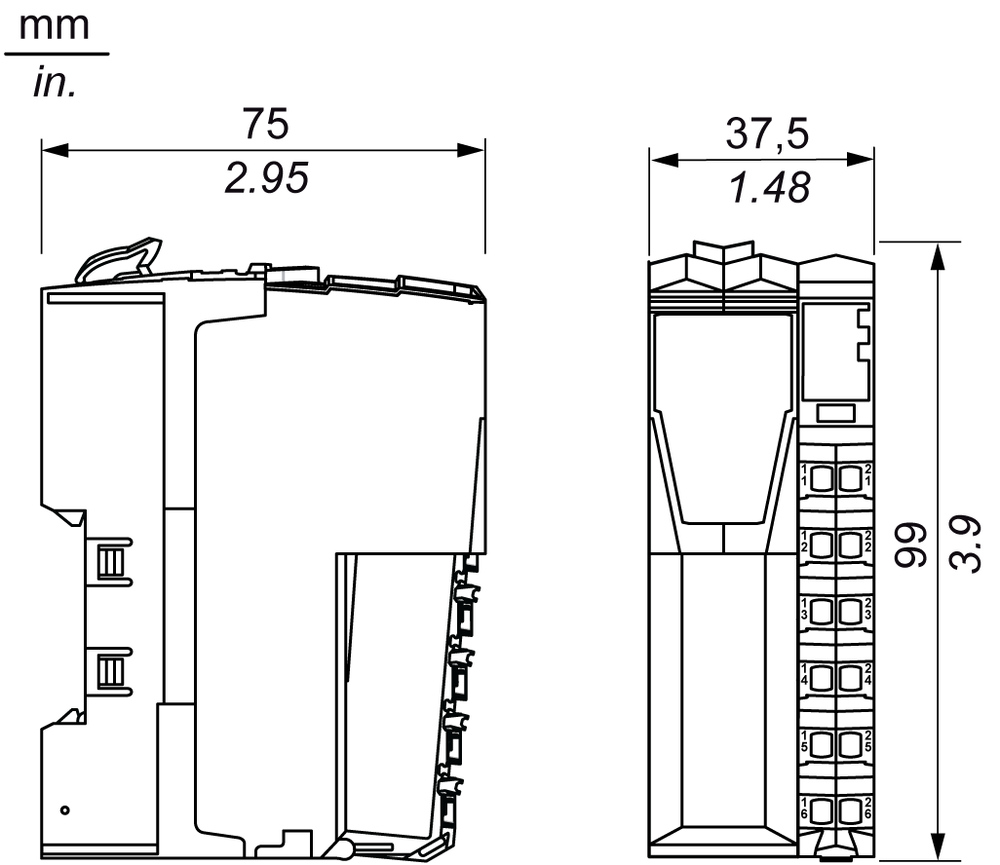
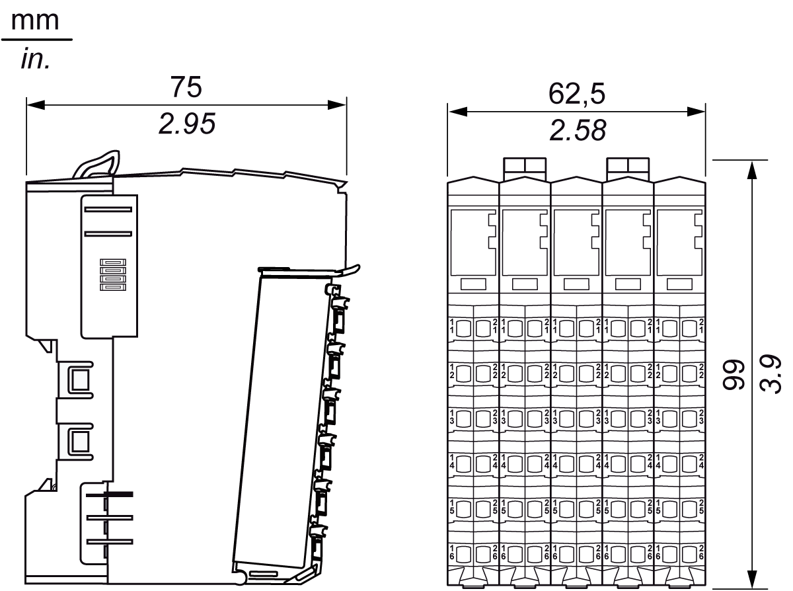
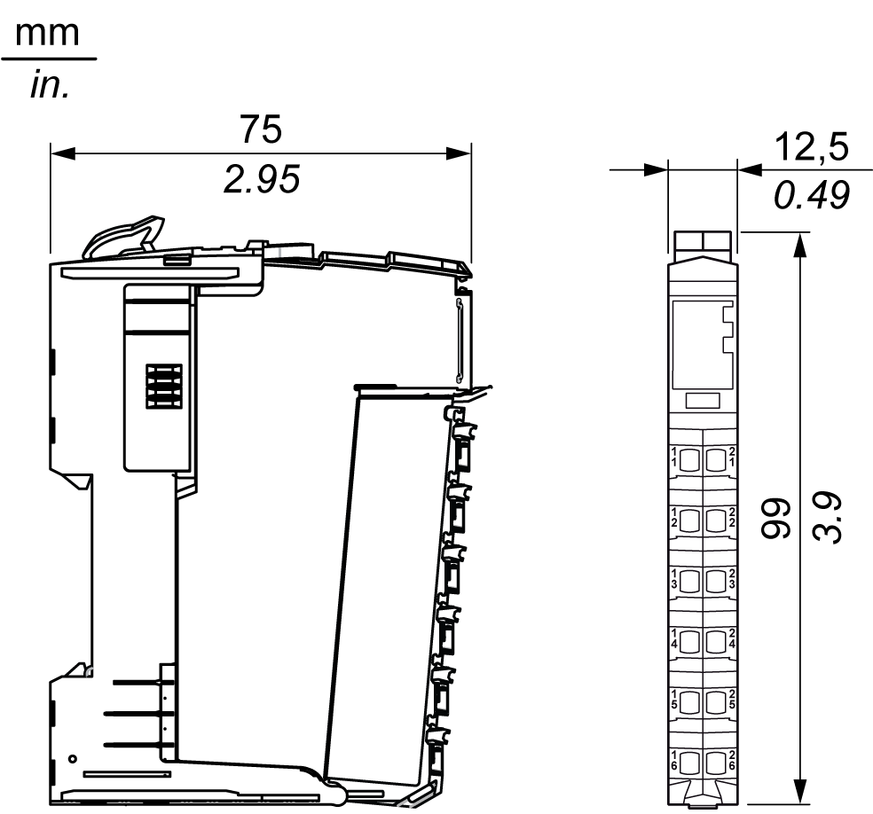

# Enclosing the TM5 System

Enclosing the TM5 System

Introduction

Components of the TM5 System are mounted "side by side". There is no space between the TM5 components.

The TM5 System components have an [IP20](../glossary/glossary.htm#XREF_D_SE_0024697_444) rating and must be enclosed. For optimal cooling and air circulation, an adequate clearance must be respected between your TM5 System (installed in the enclosure) and surrounding fixed objects (such as wire ducts and inside surfaces of the enclosure).

Size of the Enclosure

The size of the enclosure is determined by the number of expansion modules that are used with the controller, the field bus interface and any other auxiliary equipment. [Spacing requirements](#XREF_D_SE_0001563_4) must be included in determining the size of the enclosure.

Controller Dimensions

The following table gives the dimensions of the controllers:

| Reference | Depth (a) | Width (b) | Height (c) |
| --- | --- | --- | --- |
| Modicon M258 Logic Controller | | | |
| TM258LD42DT | 75 mm (2.95 in.) | 177.5 mm (6.99 in.) | 99 mm (3.90 in.) |
| TM258LD42DT4L | 240 mm (9.45 in.) |
| TM258LF42DT | 177.5 mm (6.99 in.) |
| TM258LF42DT4L | 240 mm (9.45 in.) |
| TM258LF66DT4L | 265 mm (10.43 in.) |
| TM258LF42DR | 265 mm (10.43 in.) |
| Modicon LMC058 Motion Controller | | | |
| LMC058LF42 | 75 mm (2.95 in.) | 177.5 mm (6.99 in.) | 99 mm (3.90 in.) |
| LMC058LF424 | 240 mm (9.45 in.) |

Field Bus Interface Dimensions

The following figure gives the dimensions of the field bus interface:

Compact I/O Dimensions

The following figure gives the dimensions of the compact I/O:

Slice Dimensions

The following figure gives the dimensions of the slice:

Spacing Requirements

NOTE: Keep adequate spacing for proper ventilation and to maintain an ambient temperature as described in the [environmental characteristics](TM5_-_Initial_Planning_for_TM5-2.htm#XREF_D_SE_0015384_1).

Clearances must be respected when installing the product.

There are 3 types of clearances:

oBetween the TM5 System and all sides of the cabinet (including the panel door). This type of clearance allows proper circulation of air around the TM5 System.

oBetween the TM5 System terminal blocks and the wiring ducts. This distance helps avoid electromagnetic interference between the controller and the wiring ducts.

oBetween the TM5 System and other heat generating devices installed in the same cabinet.

|  |
| --- |
| Warning_Color.gifWARNING |
| UNINTENDED EQUIPMENT OPERATION |
| oPlace devices dissipating the most heat at the top of the cabinet and ensure adequate ventilation.  oAvoid placing this equipment next to or above devices that might cause overheating.  oInstall the equipment in a location providing the minimum clearances from all adjacent structures and equipment as directed in this document.  oInstall all equipment in accordance with the specifications in the related documentation. |
| Failure to follow these instructions can result in death, serious injury, or equipment damage. |

The following graphic represents the minimum clearance requirements for a TM5 System in a cabinet:

Mounting

You can mount the TM5 System on a [DIN](../glossary/glossary.htm#XREF_D_SE_0024697_675) rail. For EMC (Electromagnetic Compatibility) compliance, a metal DIN rail must be attached to a flat metal mounting surface or mounted on an [EIA](../glossary/glossary.htm#XREF_D_SE_0024697_684) (Electronic Industries Alliance) rack or in a NEMA (National Electrical Manufacturers Association) cabinet enclosure.

You can order a suitable DIN rail from Schneider Electric:

| Rail Depth | Catalog Part Number |
| --- | --- |
| 15 mm (0.59 in.) | AM1DE200 |
| 8 mm (0.31 in.) | AM1DP200 |
| 15 mm (0.59 in.) | AM1ED200 |

Thermal Considerations

For proper heat dissipation, keep adequate spacing around your TM5 System. Mount the TM5 System in the coolest area possible, most often at the bottom of the enclosure.

The following tables list some maximum dissipation values for estimating the wattage dissipation when you plan the cooling for your TM5 System and enclosure:

| Controller Family | Reference | Maximum(1) Dissipation Value (W) |
| --- | --- | --- |
| Modicon M258 Logic Controller | TM258LD42DT | 12.3 |
| TM258LD42DT4L | 14.6 |
| TM258LF42DT | 12.5 |
| TM258LF42DT4L | 14.8 |
| TM258LF66DT4L | 18.2 |
| TM258LF42DR | 14.8 |
| Modicon LMC058 Motion Controller | LMC058LF42 | 11.9 |
| LMC058LF424 | 13.4 |
| Note:  (1) The maximum consumption value of a controller does not take into account the optional PCI communication modules nor the optional expansion modules wattage values. | | |

| PCI communication modules | Reference | Maximum Dissipation Value (W) | De-rating |
| --- | --- | --- | --- |
| Serial Line | TM5PCRS2 | 0.33 | No |
| Serial Line | TM5PCRS4 | 0.4 | No |
| Profibus DP | TM5PCDPS | 1.8 | No |

| Field Bus Interface Family | Reference | Maximum Dissipation Value (W) | De-rating |
| --- | --- | --- | --- |
| CANopen Interface Module | TM5NCO1 | 1.5 | No |
| Sercos | TM5NS31 | 1.72 | No |
| Interface Power Distribution Module (IPDM) | TM5SPS3 | 1.82 | Yes(1) |
| EtherNet/IP | TM5NEIP1 | 2.0 | Yes(2) |
| (1)   [Temperature de-rating](../TM5SPS3/TM5SPS3-3.htm#XREF_D_SE_0009143_5)  (2)   Above 2000 m, 0.5 °C (0.9 °F) every 100 m | | | |

| Compact I/O Reference | Maximum Dissipation Value (W) | De-rating (1) |
| --- | --- | --- |
| TM5C24D18T | 3.71 | Yes |
| TM5C12D8T | 2.36 | No |
| TM5C12D6T6L | 7.3 | No |
| TM5C24D12R | 4.3 | Yes |
| TM5CAI8O8VL | 5.25 | No |
| TM5CAI8O8CL | 5.25 | No |
| TM5CAI8O8CVL | 5.25 | No |
| Note:  (1) [De-ratings](../../../../../../api/crossBook?lang=en-US&virtualBookName=glossary/glossary.htm#XREF_D_SE_0024697_671) are specific to each device. Please refer to the [Modicon TM5 Compact I/O Module Hardware Guide](../../../tm5comhw&topicID=D_SE_0009768_15) for details. | | |

| Type of Slice | Electronic Module Reference of the Slice | Slice Maximum Dissipation Value (W) | De-rating (1) |
| --- | --- | --- | --- |
| Digital input | TM5SDI2D | 0.54 | No |
| TM5SDI4D | 0.86 | No |
| TM5SDI6D | 1.16 | No |
| TM5SDI12D | 2.06 | Yes |
| TM5SDI16D | 1.78 | Yes |
| TM5SDI2A | 0.82 | No |
| TM5SDI4A | 1.21 | No |
| TM5SDI6U | 1.02 | No |
| Digital output | TM5SDO2T | 0.59 | No |
| TM5SDO4T | 0.78 | No |
| TM5SDO4TA | 0.79 | No |
| TM5SDO6T | 1.02 | No |
| TM5SDO8TA | 0.35 | Yes |
| TM5SDO12T | 1.54 | Yes |
| TM5SDO16T | 1.95 | Yes |
| TM5SDO2R | 0.58 | Yes |
| TM5SDO4R | 0.93 | No |
| TM5SDO2S | 2.13 | Yes |
| Mixed [input/output](../glossary/glossary.htm#XREF_D_SE_0024697_726) | TM5SDM12DT | 1.44 | Yes |
| TM5SMM6D2L | 1.75 | Yes |
| Analog input | TM5SAI2L | 0.94 | No |
| TM5SAI2H | 1.34 | No |
| TM5SAI4L | 1.24 | No |
| TM5SAI4H | 1.64 | Yes |
| TM5SAI2PH | 1.24 | No |
| TM5SAI2TH | 0.86 | No |
| TM5SAI4PH | 1.24 | No |
| TM5SAI6TH | 1.05 | No |
| TM5SEAISG | 1.25 | No |
| [Analog output](../glossary/glossary.htm#XREF_D_SE_0024697_625) | TM5SAO2L | 1.24 | No |
| TM5SAO2H | 1.34 | No |
| TM5SAO4L | 1.64 | Yes |
| TM5SAO4H | 1.64 | Yes |
| Expert module | TM5SE1IC02505 | 1.64 | No |
| TM5SE1IC01024 | 1.54 | No |
| TM5SE2IC01024 | 1.64 | No |
| TM5SE1SC10005 | 1.64 | No |
| TM5SDI2DF | 1.10 | No |
| Transmitter modules | TM5SBET1 | 1.23 | No |
| TM5SBET7 | 1.84 | Yes |
| Receiver module | TM5SBER2 | 2.35 | Yes |
| PDM (Power Distribution Module) | TM5SPS1 | 0.93 | No |
| TM5SPS1F | 1.15 | No |
| TM5SPS2 | 1.04 | Yes |
| TM5SPS2F | 2.26 | Yes |
| CDM (Common Distribution Module) | TM5SPDG12F | 1.25 | No |
| TM5SPDD12F | 1.25 | No |
| TM5SPDG5D4F | 1.40 | No |
| TM5SPDG6D6F | 1.40 | No |
| Dummy module | TM5SD000 | 0.13 | No |
| Note:  (1) [De-ratings](../glossary/glossary.htm#XREF_D_SE_0024697_671) are specific to each device. Please refer to the expansion hardware guides for details. | | | |

The values above assume maximum bus voltage, maximum field-side voltage and maximum load currents. Typical values are often considerably lower.

|  |
| --- |
| Warning_Color.gifWARNING |
| UNINTENDED EQUIPMENT OPERATION |
| oPlace devices dissipating the most heat at the top of the cabinet and ensure adequate ventilation.  oAvoid placing this equipment next to or above devices that might cause overheating.  oInstall the equipment in a location providing the minimum clearances from all adjacent structures and equipment as directed in this document.  oInstall all equipment in accordance with the specifications in the related documentation. |
| Failure to follow these instructions can result in death, serious injury, or equipment damage. |

NOTE: Keep adequate spacing for proper ventilation and to maintain an ambient temperature. Maximum ambient temperature depends on the mounting position.

EIO0000003161.01

© 2020 Schneider Electric. All rights reserved.