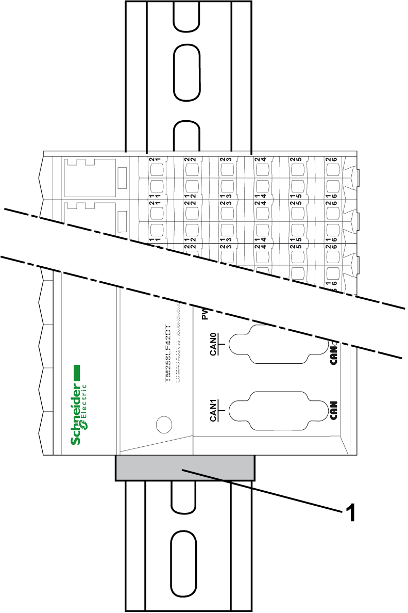

# Mounting Positions

Mounting Positions

Introduction

This section shows the correct mounting positions for the TM5 System.

Local, remote and distributed configurations follow the same rules.

The TM5 System should only be positioned as shown in the [correct](#XREF_D_SE_0001558_6) or [acceptable](#XREF_D_SE_0001558_7) mounting position figures.

Correct Mounting Position

The TM5 System must be mounted horizontally on a vertical plane as shown in the figures below:

NOTE: Keep adequate spacing for proper ventilation and to maintain an ambient temperature as described in the [environmental characteristics](TM5_-_Initial_Planning_for_TM5-2.htm#XREF_D_SE_0015384_1).

Acceptable Mounting Positions

Whenever possible, the TM5 System should only be positioned as shown in the figure above.

The TM5 System can also be mounted sideways on a vertical plane as shown below.

1   End bracket

NOTE: For a local configuration in this mounting position, expansion modules must be on top of the controller.

NOTE: The first element of the TM5 configuration (controller or slice) must be secured against slipping. An end bracket (reference AB1 AB8R35 for example) can be used to help secure the configuration.

NOTE: The temperature range is limited to –10...50 °C (14...122 °F) when installing TM5 configuration vertically.

Incorrect Mounting Position

The figures below show incorrect mounting positions:

EIO0000003161.01

© 2020 Schneider Electric. All rights reserved.