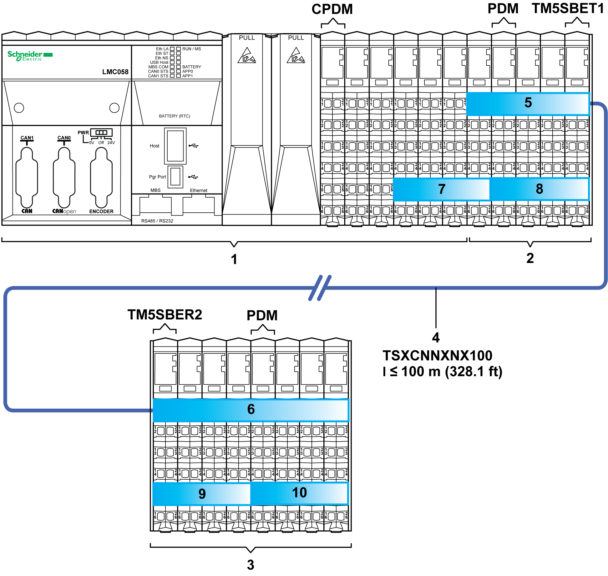
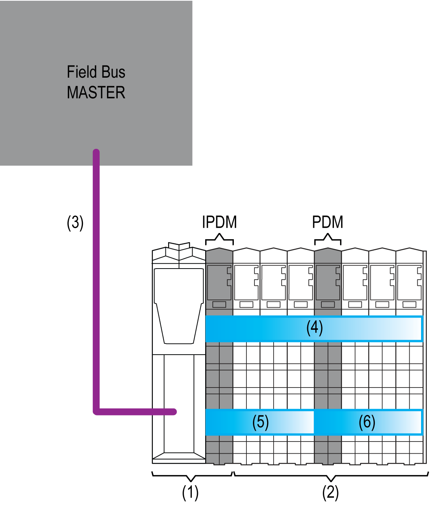

# TM5 Power Distribution Description

TM5 Power Distribution Description

Power Distribution Overview

The first (leftmost) component in the [local](../Intro_-_Description_of_the_TM5_and_TM7_System/Intro_-_Description_of_the_TM5_and_TM7_System-2.htm#XREF_D_SE_0000756_3), [remote](../Intro_-_Description_of_the_TM5_and_TM7_System/Intro_-_Description_of_the_TM5_and_TM7_System-2.htm#XREF_D_SE_0000756_4) and [distributed](../Intro_-_Description_of_the_TM5_and_TM7_System/Intro_-_Description_of_the_TM5_and_TM7_System-3.htm#XREF_D_SE_0009280_3) configurations of the TM5 System distributes power for the 24 Vdc I/O power segment and generates power for the TM5 power bus. There are other components that distribute power to create separate 24 Vdc I/O power segments, and others that distribute power and additionally generate supplemental power to the TM5 power bus.

The Controller Power Distribution Module (CPDM) is the beginning of the power distribution for the local configuration.

The TM5SBER2 Receiver module is the beginning of the power distribution for the remote configuration.

The [TM5SBET7 Transmitter module](../TM7_Part_-_Initial_Planning_for_TM7_System/TM7_Part_-_Initial_Planning_for_TM7_System-5.htm#XREF_D_SE_0009310_24) is the beginning of the power distribution for the TM7 power bus.

The Interface Power Distribution Module (IPDM) of the field bus interface is the beginning of the power distribution for the distributed configuration.

Where and when needed, Power Distribution Modules (PDM) could be added to:

oDivide the 24 Vdc I/O power segment into several separated 24 Vdc I/O power segments, or;

oDivide the 24 Vdc I/O power segment into several separated 24 Vdc I/O power segments and provide supplementary power to the TM5 power bus if required by your I/O configuration.

The figure below shows the power distribution overview of local and remote configurations:

(1)   Controller

(2)   Local expansions

(3)   Remote expansions

(4)   Expansion bus cable

(5)   TM5 power bus of the local configuration

(6)   TM5 power bus of the remote configuration

(7...10)   24 Vdc I/O power segments

TM5SBET1   Transmitter module

TM5SBER2   Receiver module

CPDM   Controller Power Distribution Module

PDM   Power Distribution Module

The figure below shows the power distribution overview of a distributed configuration:

(1)   Field bus interface

(2)   Distributed expansions

(3)   Field bus cable

(4)   TM5 power bus of the distributed configuration

(5...6)   24 Vdc I/O power segments

IPDM   Interface Power Distribution Module

PDM   Power Distribution Module

24 Vdc I/O Power Segment Description

Power is distributed to the inputs and outputs of the TM5 System through the 24 Vdc I/O power segment.

The 24 Vdc I/O power segment of the local configuration begins with the first embedded regular I/O of the controller and is terminated at the point where another PDM has been inserted into the TM5 System or at the end of the configuration.

The following table gives the first and last devices of the 24 Vdc I/O power segment(s):

| TM5 Configuration | | Segment Begin | Segment End |
| --- | --- | --- | --- |
| [Local](../Intro_-_Description_of_the_TM5_and_TM7_System/Intro_-_Description_of_the_TM5_and_TM7_System-2.htm#XREF_D_SE_0000756_3) | First  24 Vdc I/O power segment | The first embedded regular I/O | The last expansion module or the first  PDM (from left to right) of the configuration. |
| Second  24 Vdc I/O power segment | The first  PDM (from left to right) of the configuration. | The last expansion module or the second  PDM (from left to right) of the configuration. |
| ... | ... | ... |
| [Remote](../Intro_-_Description_of_the_TM5_and_TM7_System/Intro_-_Description_of_the_TM5_and_TM7_System-2.htm#XREF_D_SE_0000756_4) | First  24 Vdc I/O power segment | The Receiver module | The last remote expansion module or the first  PDM (from left to right) of the configuration |
| Second  24 Vdc I/O power segment | The first  PDM (from left to right) of the configuration. | The last expansion module or the second  PDM (from left to right) of the configuration. |
| ... | ... | ... |
| [Distributed](../Intro_-_Description_of_the_TM5_and_TM7_System/Intro_-_Description_of_the_TM5_and_TM7_System-3.htm#XREF_D_SE_0009280_3) | First  24 Vdc I/O power segment | The IPDM | The last remote expansion module or the first  PDM (from left to right) of the configuration |
| Second  24 Vdc I/O power segment | The first  PDM (from left to right) of the configuration. | The last expansion module or the second  PDM (from left to right) of the configuration. |
| ... | ... | ... |

A segment is a group of expansion modules that are supplied by the same power distribution module.

The power provided on the 24 Vdc I/O power segment is consumed by the 24 Vdc modules placed in this segment.

The reasons to build a new segment are:

oTo separate groups of modules. For example, a group of inputs separated from a group of outputs.

oTo provide power to the 24 Vdc I/O power segment (in the case that the power of the previous segment has been consumed by other I/O modules).

oTo provide supplementary power to the TM5 power bus.

TM5 Power Bus Description

The TM5 bus consists in two parts:

oTM5 data bus

oTM5 power bus

The TM5 power bus distributes the power to supply the electronics of the expansion modules of a local, remote or distributed configuration. If needed the power on the TM5 bus can be reinforced by adding specific PDMs depending on the reference.

The following table gives the first and last devices of the TM5 power bus:

| TM5 Configuration | Power Bus Begin | Power Bus End |
| --- | --- | --- |
| [Local](../Intro_-_Description_of_the_TM5_and_TM7_System/Intro_-_Description_of_the_TM5_and_TM7_System-2.htm#XREF_D_SE_0000756_3) | The first local expansion I/O | The last local expansion I/O or the Transmitter module |
| [Remote](../Intro_-_Description_of_the_TM5_and_TM7_System/Intro_-_Description_of_the_TM5_and_TM7_System-2.htm#XREF_D_SE_0000756_4) | The Receiver module | The last remote expansion I/O or Transmitter module |
| [Distributed](../Intro_-_Description_of_the_TM5_and_TM7_System/Intro_-_Description_of_the_TM5_and_TM7_System-3.htm#XREF_D_SE_0009280_3) | The IPDM | The last distributed expansion I/O or Transmitter module |

NOTE: The TM5SBET1 transmitter module must be the last electronic module in either the local or remote TM5 configuration that you intend to extend.

Controller Power Distribution Module (CPDM)

The Controller Power Distribution Module ([CPDM](../SPIG_TM5_TM7_-_Basics_of_the_TM5_System/SPIG_TM5_TM7_-_Basics_of_the_TM5_System-2.htm#XREF_D_SE_0000767_8)) is the connection of the controller to the external 24 Vdc power supplies and distributes the power to the different parts of the controller.

Among other things, the CPDM connects:

oDirectly the external power supply to the 24 Vdc I/O power segment.

oThe external power supply to the internal power supply that generates the power distributed on the TM5 power bus, which is derived from the 24 Vdc Main power connection.

The following table describes the parts powered by the 24 Vdc I/O power segment and the TM5 power bus:

| Designation | Description |
| --- | --- |
| 24 Vdc I/O power segment | Serves:  othe embedded regular I/O,  othe sensors and actuators connected to the embedded regular I/O,  othe expansion modules,  othe sensors and actuators connected to the expansion modules,  othe external devices connected to the Common Distribution Modules (CDM). |
| TM5 power bus | Serves the expansion slice electronics (bus bases and electronic modules) of the local configuration. |

Interface Power Distribution Module (IPDM)

The Interface Power Distribution Module ([IPDM](../SPIG_TM5_TM7_-_Basics_of_the_TM5_System/SPIG_TM5_TM7_-_Basics_of_the_TM5_System-3.htm#XREF_D_SE_0015378_6)) is the connection of the field bus interface to the external 24 Vdc power supplies.

Among other things, the IPDM connects:

oDirectly the external power supply to the 24 Vdc I/O power segment.

oThe external power supply to the internal power supply that generates the power distributed on the TM5 power bus, which is derived from the 24 Vdc Main power connection.

The following table describes the parts powered by the 24 Vdc I/O power segment and the TM5 power bus:

| Designation | Description |
| --- | --- |
| 24 Vdc I/O power segment | Serves:  othe distributed expansion modules,  othe sensors and actuators connected to the distributed expansion modules,  othe external devices connected to the Common Distribution Modules (CDM) of the distributed configuration. |
| TM5 power bus | Serves the electronic of the expansions (bus bases and electronic modules) of the distributed configuration. |

Receiver Module (TM5SBER2)

The TM5SBER2 integrates an electronic power supply that generates the power distributed by the TM5 power bus.

It also connects the external 24 Vdc power supply to the 24 Vdc I/O power segment.

The following table describes the parts powered by the 24 Vdc I/O power segment and the TM5 power bus:

| Designation | Description |
| --- | --- |
| 24 Vdc I/O power segment | Serves:  othe remote expansion modules,  othe sensors and actuators connected to the remote expansion modules,  othe external devices connected to the Common Distribution Modules (CDM) of the remote configuration. |
| TM5 power bus | Serves the electronic of the expansions (bus bases and electronic modules). |

Power Distribution Module (PDM)

Depending of the TM5 configuration and the current consumed on either the TM5 power bus or the 24 Vdc I/O power segment(s), you may need to add PDMs to create another 24 Vdc power segment and/or supplement power to the electronic of the expansions via the TM5 power bus.

The following table describes the parts powered by the 24 Vdc I/O power segment and the TM5 power bus:

| Designation | Description |
| --- | --- |
| 24 Vdc I/O power segment | Serves:  othe expansion modules of the segment determined by the PDM,  othe sensors and actuators connected to the expansion modules of the segment determined by the PDM,  othe external devices connected to the Common Distribution Modules (CDM) in the segment determined by the PDM. |
| TM5 power bus (depends on PDM references) | Serves the electronic of the expansions (bus bases and electronic modules) of the expanded configuration. |

Supplying the 24 Vdc I/O Power Segment and the TM5 Power Bus

TM5 Power System, Power Distribution Description, Supplying the 24 Vdc I/O Power Segment and the TM5 Power Bus:

| Equipment | | Maximum Current Distributed on the 24 Vdc I/O Power Segment | Current Supplied to the TM5 Power Bus | |
| --- | --- | --- | --- | --- |
| Function | Reference | - 10...55 °C (14...131°F) | 55...60 °C (131...140 °F) |
| CPDM | – | 10 A | 400 mA | 400 mA |
| Receiver module | TM5SBER2 | 10 A | 1156 mA | 750 mA |
| PDM | TM5SPS1 | 10 A | No | No |
| TM5SPS1F | 6.3 A | No | No |
| TM5SPS2 | 10 A | 1136 mA | 740 mA |
| TM5SPS2F | 6.3 A | 1136 mA | 740 mA |
| IPDM | TM5SPS3 | 10 A | 750 mA | 500 mA |

EIO0000003161.01

© 2020 Schneider Electric. All rights reserved.