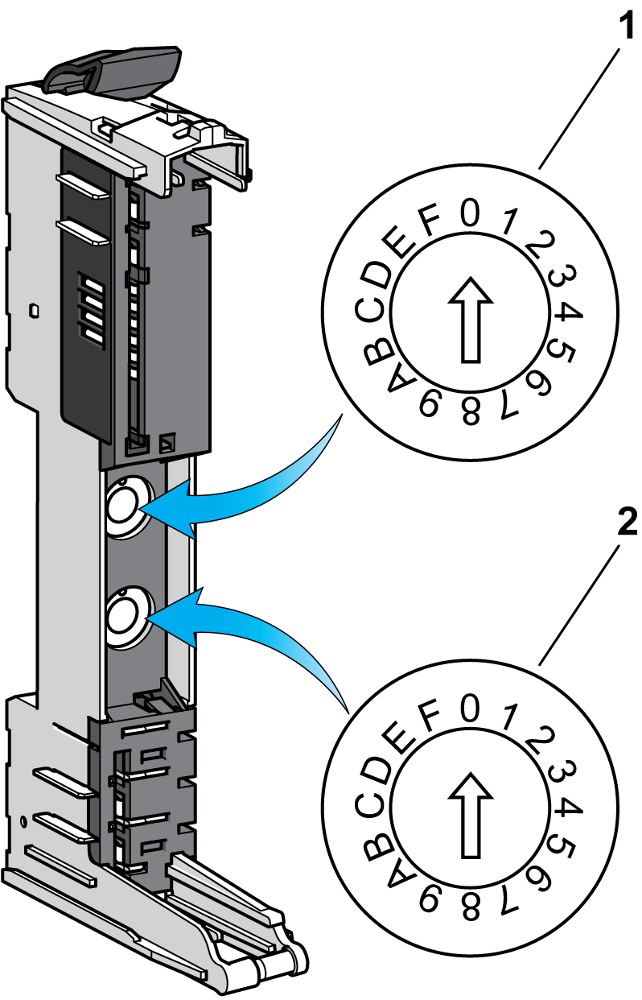
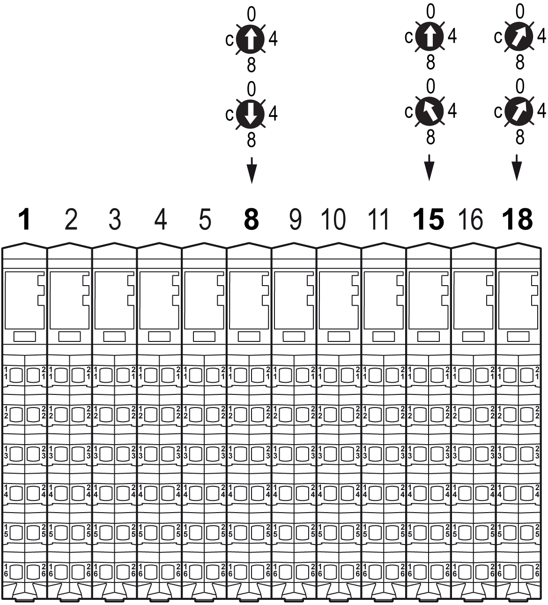

# Addressing

Addressing

Introduction

The TM5 backplane of bus bases, which holds the individual I/O modules together, is auto-addressing. It is usually not necessary to set the address setting numbers.

However, in certain cases, it may be necessary to define specific slices or potential groups at fixed addresses, regardless of the preceding modules in the backplane. For this purpose, there are bus bases in the TM5 System with rotary switches, which allow you to set the address of an individual slice. All subsequent slices refer to this offset and are again automatically addressed from this point forward.

NOTE: Manual address setting is not supported with TM5NS31 and TM5NEIP1 fieldbus interfaces. In addition, manual address setting is not supported by EcoStruxure Machine Expert. Therefore, bus bases with rotary switches are unnecessary. However, if the fieldbus interfaces are used, the address setting of the switches must be 0.

Addressing Principle

In the TM5 System, the address setting number begins at 1 and is the address number of:

oThe first embedded regular I/O module of the controller. The embedded Expert I/O integrated in the controllers do not have physical addresses.

oThe Interface Power Distribution Module (IPDM) of the distributed configuration.

The following modules and expansion modules addresses are assigned according to their positions in the TM5 backplane (+1 regarding the left preceding module address).

Bus Bases with Address Setting

The following table gives you the references of the [bus bases](../TM5_Bus_bases_and_Terminal_blocks/TM5_Bus_bases_and_Terminal_blocks-2.htm#XREF_D_SE_0015418_1) with address setting:

| References | Description | Color |
| --- | --- | --- |
| TM5ACBM05R | 24 Vdc / 24 Vdc I/O power segment left isolated with address setting | Gray |
| TM5ACBM15 | 24 Vdc / 24 Vdc I/O power segment pass-through with address setting | White |

Address Setting Rotary Switches

1   x16

2   x1

The address of the slice is set using the address setting rotary switches (01 - FD [hex](../glossary/glossary.htm#XREF_D_SE_0024697_497)).

The address setting 00 hex causes automatic assignment of the address of the expansion module.

NOTE: In EcoStruxure Machine Expert software the address setting number is in decimal.

|  |
| --- |
| Warning_Color.gifWARNING |
| UNINTENDED EQUIPMENT OPERATION |
| oVerify that the addressing of the bus base modules is ordinal within the physical layout of the configuration from left to right.  oVerify that the physical configuration (order and references of the I/O modules and any addressed bus bases) corresponds exactly to that defined in the software configuration for your application. |
| Failure to follow these instructions can result in death, serious injury, or equipment damage. |

Set the rotary switches before installing the bus base on the DIN rail and making a connection to the other components of your TM5 system. If the bus base is already installed before its address has been set, then remove all power to your TM5 system before setting the address.

|  |
| --- |
| DangerElectrical_Color.gifDanger_Color.gifDANGER |
| HAZARD OF ELECTRIC SHOCK, EXPLOSION OR ARC FLASH |
| oDisconnect all power from all equipment including connected devices prior to removing any covers or doors, or installing or removing any accessories, hardware, cables, or wires except under the specific conditions specified in the appropriate hardware guide for this equipment.  oAlways use a properly rated voltage sensing device to confirm the power is off where and when indicated.  oReplace and secure all covers, accessories, hardware, cables, and wires and confirm that a proper ground connection exists before applying power to the unit.  oUse only the specified voltage when operating this equipment and any associated products. |
| Failure to follow these instructions will result in death or serious injury. |

You must use a flat-head screwdriver of the size noted below to turn the rotary address selection switches.

Example

The example below demonstrates the automatic addressing of the slices up to the point of a bus base with an address setting rotary switch. This bus base forces the address for the slice, in the example, to 8. From that point, the automatic sequential addressing continues until the next bus base with an address setting rotary switch is encountered.

EIO0000003161.01

© 2020 Schneider Electric. All rights reserved.