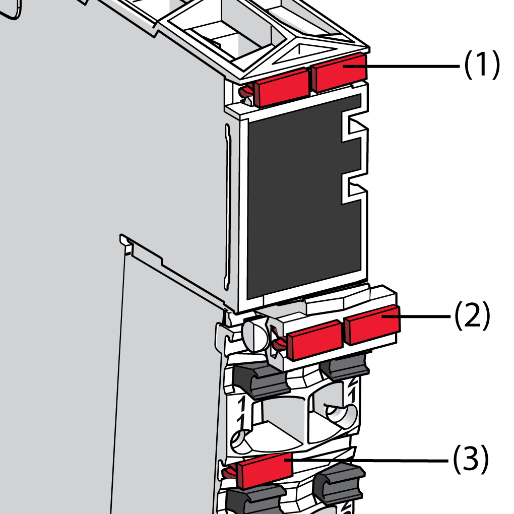
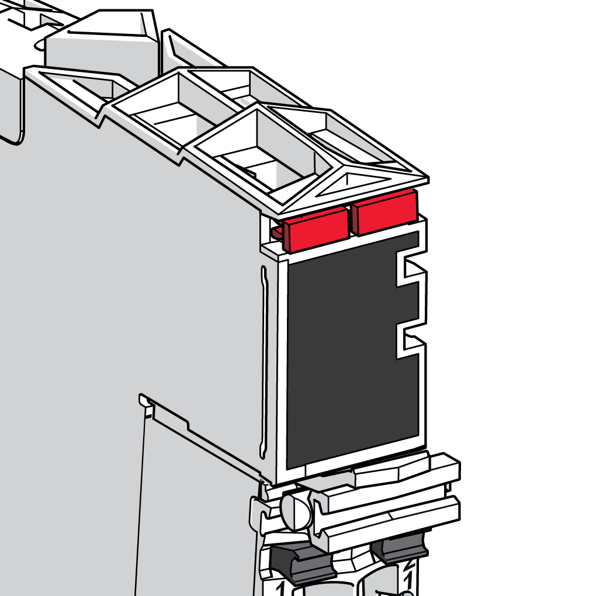

# Labeling the TM5 System

Labeling the TM5 System

Introduction

This section explains how to label:

1   The electronic module.

2   The locking clip of the terminal block

3   The connectors of the terminal block

NOTE: The following procedure explains how to install one label tab by using the single-width cutters of the labeling tool. You can extrapolate with the double-width cutters of the [labeling tool](../SPIG_TM5_TM7_-_Basics_of_the_TM5_System/SPIG_TM5_TM7_-_Basics_of_the_TM5_System-6.htm#XREF_D_SE_0000784_5) to install two label tabs in the same step.

| Single-width Cutters | Double-width Cutters |
| --- | --- |
| G-SE-0003788.1.gif-high.gif | G-SE-0000450.1.gif-high.gif |

Labeling the Connectors of the Terminal Block

You can label the connectors of the terminal block as well as the locking clip of the terminal block itself.

The following table describes how to label the terminals of the terminal block:

| Step | Action | |
| --- | --- | --- |
| 1 | Grip the desired label tab with the single width cutters of the labeling tool. | G-SE-0003788.1.gif-high.gif |
| 2 | Press with the labeling tool to separate the label. | G-SE-0003787.1.gif-high.gif |
| 3 | Center the label tab over the slot on the terminal block. | G-SE-0000452.1.gif-high.gif |
| 4 | Hold the labeling tool at approximately an 80° angle to the terminal block. | G-SE-0000453.1.gif-high.gif |
| 5 | Press with the labeling tool to insert the feet of the label tab into the slot.  Result: Inserted label. | G-SE-0000454.1.gif-high.gif |

Labeling the Terminal Locking Clip

To label the terminal block itself, insert one or two label tabs in the [terminal locking clip](../SPIG_TM5_TM7_-_Basics_of_the_TM5_System/SPIG_TM5_TM7_-_Basics_of_the_TM5_System-6.htm#XREF_D_SE_0000784_7) using the same procedure described above.

The following figure shows the labeled terminal locking clip:

Labeling the Electronic Module

The electronic module is labeled in a manner similar to the terminal block:

EIO0000003161.01

© 2020 Schneider Electric. All rights reserved.