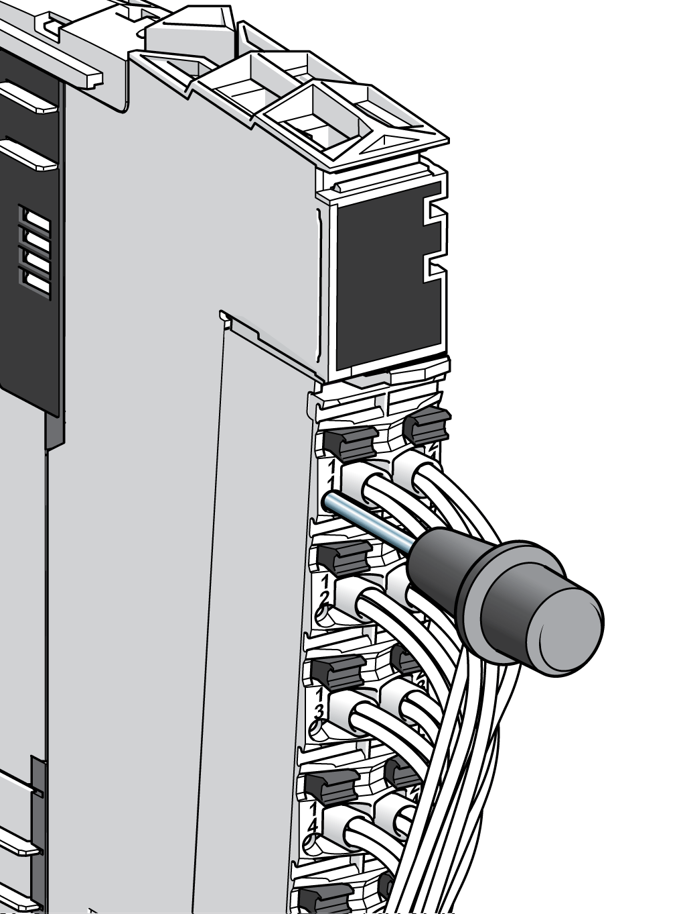
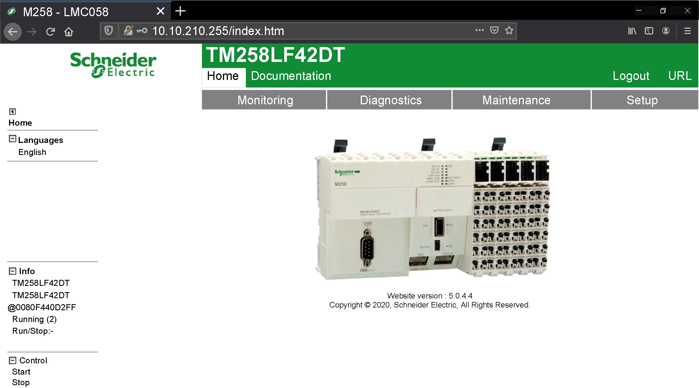

# Diagnostics

Diagnostics

Introduction

The TM5 System offer several levels of diagnostics:

oTest points on the terminal blocks

oDirectly on the module using [LED](../glossary/glossary.htm#XREF_D_SE_0024697_302) displays

oVia EcoStruxure Machine Expert software

oWeb server

Test Points

Each [terminal block](../SPIG_TM5_TM7_-_Basics_of_the_TM5_System/SPIG_TM5_TM7_-_Basics_of_the_TM5_System-5.htm#XREF_D_SE_0015379_7) has an access point for a test probe. You can measure the terminal potential without disconnecting the wire.

The following figure illustrates the use of the test probes:

Status LEDs

TM5 bus status, power, I/O status and channel states are displayed in direct relationship to the channels or the [function](../glossary/glossary.htm#XREF_D_SE_0024697_714). The different states are displayed differently, for example green for OK, red for detected error.

Refer to the hardware guides for the products of the TM5 System for status LEDs descriptions.

EcoStruxure Machine Expert Software

With the TM5 System, status data does not result in additional communication load, which would result in considerable differences between theoretically possible bus speeds and real requirements during operation. All necessary status data is always transferred cyclically, with no exceptions.

Refer to the [EcoStruxure Machine Expert Programming Manual](../../../../../../api/crossBook?lang=en-US&virtualBookName=SoMProg&topicID=D_SG_0026478_8).

Web Server

The controller provides as standard equipment an embedded Web server with a predefined factory built-in website. You can use the pages of the website for module setup and control as well as application diagnostics and monitoring. These pages are ready to use with a Web browser. No configuration or programming is required.

The following figure shows you the Web site home page of the Web server:

NOTE: Schneider Electric adheres to industry best practices in the development and implemen­tation of control systems. This includes a "Defense-in-Depth" approach to secure an Industrial Control System. This approach places the controllers behind one or more firewalls to restrict access to authorized personnel and protocols only.

|  |
| --- |
| Warning_Color.gifWARNING |
| UNAUTHENTICATED ACCESS AND SUBSEQUENT UNAUTHORIZED MACHINE OPERATION |
| oEvaluate whether your environment or your machines are connected to your critical infrastructure and, if so, take appropriate steps in terms of prevention, based on Defense-in-Depth, before connecting the automation system to any network.  oLimit the number of devices connected to a network to the minimum necessary.  oIsolate your industrial network from other networks inside your company.  oProtect any network against unintended access by using firewalls, VPN, or other, proven security measures.  oMonitor activities within your systems.  oPrevent subject devices from direct access or direct link by unauthorized parties or unauthen­ticated actions.  oPrepare a recovery plan including backup of your system and process information. |
| Failure to follow these instructions can result in death, serious injury, or equipment damage. |

For more details, refer to the programming guide associated with your particular controller.

EIO0000003161.01

© 2020 Schneider Electric. All rights reserved.