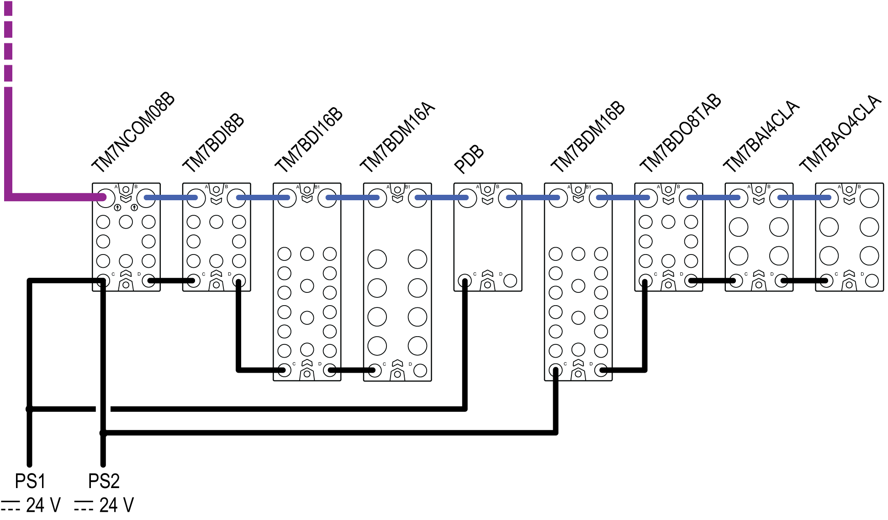

# Example 1: Current Consumed by a TM7 Distributed I/O Configuration

Example 1: Current Consumed by a TM7 Distributed I/O Configuration

Introduction

This first example is for a TM7 distributed I/O configuration (TM7 field bus interface I/O block and TM7 I/O blocks). A [later example](../TM5_-_Initial_Planning_for_TM5/TM5_-_Initial_Planning_for_TM5-11.htm#XREF_D_SE_0002420_1) is based on TM7 remote expansion I/O blocks (TM5 Transmitter module and its remote expansion blocks). From these examples, you should be able to make the calculations necessary for your TM7 System.

In a TM7 distributed I/O configuration, the TM7 field bus interface I/O block connects:

othe external power supply directly to the 24 Vdc I/O power segment,

othe external power supply to the internal power supply that generates the power distributed on the TM7 power bus, which is derived from the 24 Vdc Main power connection.

All current consumption values are documented in the chapter [Association and Power Consumption Tables](../TM5_TM7_-_Tables/TM5_TM7_-_Tables-1.htm#XREF_D_SE_0001911_1).

Planning Example

This configuration example includes:

oThe CANopen interface I/O block TM7NCOM08B equipped with 8 digital input or output configurable channels.

oSome expansion blocks:

oTM7BDI8B

oTM7BDI16B

oTM7BDM16A

oTM7BDM16B

oTM7BDO8TAB

oTM7BAI4CLA

oTM7BAO4CLA

oAssumptions used for the purposes of calculating the consumption of this example:

TM7NCOM08B: The maximum current distributed on the 24 Vdc I/O power segment is limited by an external isolated power supply of 4000 mA.

TM7BDI8B: The current to supply the electronic sensors of this example has been estimated at 25 mA per sensor, or 200 mA total for the block.

TM7BDM16A: The sum of the current draw for all outputs connected to the block is never more than 2500 mA at any given time.

TM7BDM16B: The sum of the current draw for all outputs connected to the block is never more than 1500 mA at any given time.

The current to supply the electronic sensors of this example has been estimated at 25 mA per sensor, or 200 mA total for the block.

TM7BDO8TAB: Only 5 of the outputs are active at any given time, and that the maximum current draw of any given output is 1000 mA, or 5000 mA total for the block.

The following graphic shows the example configuration connected to the power supplies PS1 and PS2:

PS1   External isolated main power supply, 24 Vdc

PS2   External isolated I/O power supply, 24 Vdc

Refer to the section [Wiring the Power Supply](TM7_Part_-_Initial_Planning_for_TM7_System-12.htm#XREF_D_SE_0009316_1) for more information.

The following table shows the current supplied and consumed in mA on the TM7 power bus and the 24 Vdc I/O power segment:

| TM7NCOM08B | TM7BDI8B | TM7BDI16B | TM7BDM16A | TM7BDM16B | TM7BDO8TAB | TM7BAI4CLA | TM7BAO4CLA | Legend |
| --- | --- | --- | --- | --- | --- | --- | --- | --- |
| 150 |  |  |  |  |  |  |  | (1) |
|  | 38 | 38 | 38 | 38 | 38 | 38 | 38 | (2) |
|  | 112 | 74 | 36 | –2 | –40 | –78 | –116 | (3) |
| 4000 |  |  |  |  |  |  |  | (4) |
| 84 | 42 | 21 | 125 | 125 | 84 | 125 | 188 | (5) |
| 800 | 0 | 0 | 2500 | 1500 | 5000 | – | – | (6) |
| 100 | 200 | 0 | 0 | 200 | – | – | – | (7) |
| 984 | 242 | 21 | 2625 | 1625 | 5484 | 125 | 188 | (8) |
| 3016 | 2774 | 2753 | 128 | –1697 | –6781 | –6906 | –7094 | (9) |
| Legend:  External isolated main power supply, 24 Vdc  (1) Current supplied on the TM7 power bus  (2) Consumption of the TM7 I/O block  (3) Remaining current available after block consumption  External isolated I/O power supply, 24 Vdc  (4) Current supplied on the 24 Vdc I/O power segment  (5) Consumption of the electronics of the TM7 I/O block  (6) Consumption of the loads of the output channels  (7) Consumption of the supply to sensors, actuators or external devices  (8) Total TM7 I/O block consumption  (9) Remaining current available after block consumption | | | | | | | | |

Current Consumed on the TM7 Power Bus

The TM7NCOM08B generates 150 mA on the TM7 power bus to supply expansion blocks. The TM7 power bus begins with the TM7NCOM08B block and terminates with the TM7BAO4CLA expansion block.

The total current consumed on the TM7 power bus is 266 mA and exceeds the 150 mA capacity of the segment.

Observing [mounting PDBs rules](TM7_Part_-_Initial_Planning_for_TM7_System-5.htm#XREF_D_SE_0009310_17), you must supplement the TM7 power bus by adding a TM7SPS1A. For example you can place the TM7SPS1A between a TM7BDM16B and a TM7BDM16A blocks.

The following table shows, the current supplied and consumed in mA on the TM7 power bus:

| TM7NCOM08B | TM7BDI8B | TM7BDI16B | TM7BDM16A | TM7SPS1A | TM7BDM16B | TM7BDO8TAB | TM7BAI4CLA | TM7BAO4CLA | Legend |
| --- | --- | --- | --- | --- | --- | --- | --- | --- | --- |
| 150 |  |  |  | 750 |  |  |  |  | (1) |
|  | 38 | 38 | 38 |  | 38 | 38 | 38 | 38 | (2) |
|  | 112 | 74 | 36 | 786 | 748 | 710 | 672 | 634 | (3) |
| 4000 |  |  |  |  |  |  |  |  | (4) |
| 84 | 42 | 21 | 125 |  | 125 | 84 | 125 | 188 | (5) |
| 800 | 0 | 0 | 2500 |  | 1500 | 5000 | – | – | (6) |
| 100 | 200 | 0 | 0 |  | 200 | – | – | – | (7) |
| 984 | 242 | 21 | 2625 |  | 1625 | 5484 | 125 | 188 | (8) |
| 3016 | 2774 | 2753 | 128 |  | –1697 | –6781 | –6906 | –7094 | (9) |
| Legend:  External isolated main power supply, 24 Vdc  (1) Current supplied on the TM7 power bus  (2) Consumption of the TM7 I/O block  (3) Remaining current available after block consumption  External isolated I/O power supply, 24 Vdc  (4) Current supplied on the 24 Vdc I/O power segment  (5) Consumption of the electronics of the TM7 I/O block  (6) Consumption of the loads of the output channels  (7) Consumption of the supply to sensors, actuators or external devices  (8) Total TM7 I/O block consumption  (9) Remaining current available after block consumption | | | | | | | | | |

The total current consumed on the TM7 power bus is 266 mA, and does not exceed the 900 mA capacity of the TM7 power bus.

The next step is to calculate the current consumed on the 24 Vdc I/O power segment to validate the configuration of this example.

Current Consumed on the 24 Vdc I/O Power Segment

The 24 Vdc I/O power segment begins with the TM7NCOM08B and finishes with the TM7BAO4CLA block. The capacity of this 24 Vdc I/O power segment is limited to 4000 mA in this example.

In this example, the total current consumed on the 24 Vdc I/O power segment is 11094 mA and exceeds the 4000 mA capacity of this segment.

This requires you to divide the existing segment into two segments by connecting a TM7 I/O block to a power supply.

For this example, the TM7BDM16B is connected to the PS2 power supply.

The first 24 Vdc I/O power segment begins with the TM7NCOM08B and finishes with the TM7BDM16A. The capacity of this segment is limited to 4000 mA.

The second 24 Vdc I/O power segment begins with the TM7BDM16B and finishes with the TM7BAO4CLA. The capacity of this segment is limited to 8000 mA.

The following graphic shows the example configuration connected to the power supplies PS1 and PS2:

PS1   External isolated main power supply, 24 Vdc

PS2   External isolated I/O power supply, 24 Vdc

The following table shows, the current supplied and consumed in mA on the 24 Vdc I/O power segment after connection of the TM7BDM16B to the power supply PS2:

| TM7NCOM08B | TM7BDI8B | TM7BDI16B | TM7BDM16A | TM7SPS1A | TM7BDM16B | TM7BDO8TAB | TM7BAI4CLA | TM7BAO4CLA | Legend |
| --- | --- | --- | --- | --- | --- | --- | --- | --- | --- |
| 150 |  |  |  | 750 |  |  |  |  | (1) |
|  | 38 | 38 | 38 |  | 38 | 38 | 38 | 38 | (2) |
|  | 112 | 74 | 36 | 786 | 748 | 710 | 672 | 634 | (3) |
| 4000 |  |  |  |  | 8000 |  |  |  | (4) |
| 84 | 42 | 21 | 125 |  | 125 | 84 | 125 | 188 | (5) |
| 800 | 0 | 0 | 2500 |  | 1500 | 5000 | – | – | (6) |
| 100 | 200 | 0 | 0 |  | 300 | – | – | – | (7) |
| 984 | 242 | 21 | 2625 |  | 1825 | 5084 | 125 | 188 | (8) |
| 3016 | 2774 | 2753 | 128 |  | 6175 | 1091 | 966 | 778 | (9) |
| Legend:  External isolated main power supply, 24 Vdc  (1) Current supplied on the TM7 power bus  (2) Consumption of the TM7 I/O block  (3) Remaining current available after block consumption  External isolated I/O power supply, 24 Vdc  (4) Current supplied on the 24 Vdc I/O power segment  (5) Consumption of the electronics of the TM7 I/O block  (6) Consumption of the loads of the output channels  (7) Consumption of the supply to sensors, actuators or external devices  (8) Total TM7 I/O block consumption  (9) Remaining current available after block consumption | | | | | | | | | |

The total current consumed on the first 24 Vdc I/O power segment is 3872 mA and does not exceed the 4000 mA capacity of this segment.

The total current consumed on the second 24 Vdc I/O power segment is 7222 mA and does not exceed the 8000 mA capacity of that segment.

EIO0000003161.01

© 2020 Schneider Electric. All rights reserved.