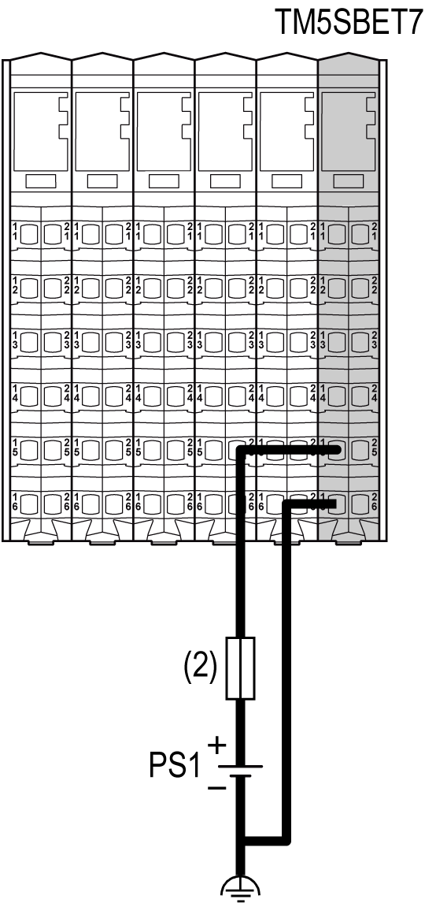
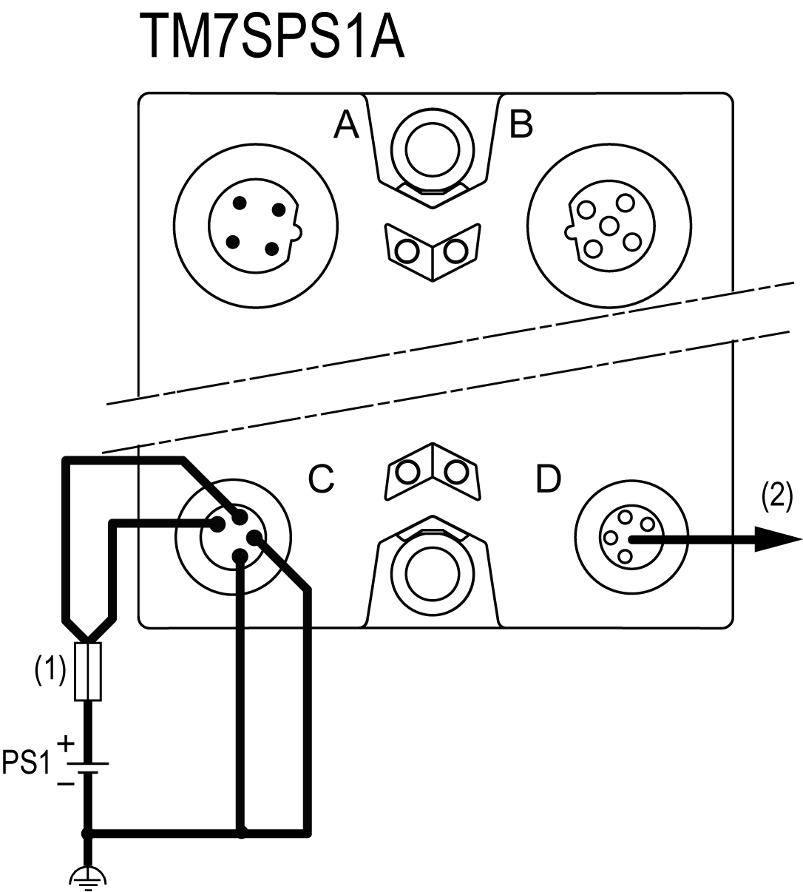

# Wiring the Power Supply

Wiring the Power Supply

Overview

To distribute current for the 24 Vdc I/O power segment(s) and TM7 power bus, and according to the [power distribution description](TM7_Part_-_Initial_Planning_for_TM7_System-5.htm#XREF_D_SE_0009310_1), the following modules and blocks are connected to an external power source:

oTransmitter module (TM5SBET7)

oField bus interface I/O block

oPower Distribution Block (PDB)

oI/O blocks

Source power for these can come from one or more supplies. Your requirements are dictated by:

ovoltage and current needs

oisolation requirements

NOTE: Connect the 0 Vdc power circuits together and to the functional ground (FE) of your system to meet the EMC requirements.

|  |
| --- |
| Danger_Color.gifDANGER |
| HAZARD OF ELECTRIC SHOCK, EXPLOSION, OVERHEATING AND FIRE |
| oDo not connect the modules directly to line voltage.  oUse only isolating PELV systems according to IEC 61140 to supply power to the modules.  oConnect the 0 Vdc of the external power supplies to FE (Functional Earth/ground). |
| Failure to follow these instructions will result in death or serious injury. |

Wiring the Transmitter Module (TM5SBET7)

The [TM5SBET7](TM7_Part_-_Initial_Planning_for_TM7_System-5.htm#XREF_D_SE_0009310_24) is the connection to the external 24 Vdc power supply and the beginning of the power distribution for the TM7 remote configuration. The power is supplied by one external isolated power supply depending on current needs and capabilities.

The following figure shows the wiring of the TM5SBET7 wired with one external 24 Vdc power supply:

(2)   External fuse, Type T slow-blow, 1 A, 250 V

PS1   External isolated power supply, 24 Vdc

NOTE: Connect the 0 Vdc power circuits together and to the functional ground (FE) of your system. If you do not interconnect the 0 Vdc circuits of the external power supplies, the status LEDs may not function correctly. In addition, there may potentially be more significant consequences such as an explosion and/or fire hazard.

|  |
| --- |
| Danger_Color.gifDANGER |
| POTENTIAL EXPLOSION OR FIRE |
| Always connect the 0 Vdc terminals of the external power supplies to the functional ground (FE) of your system. |
| Failure to follow these instructions will result in death or serious injury. |

Wiring the Field Bus Interface I/O Block

The field bus interface I/O block is the beginning of the power distribution for the TM7 distributed configuration. Power is supplied by two external isolated power supplies depending on current needs and capabilities.

There are two power connections to be made to the field bus interface I/O block from your source power supplies:

| Connections | 2 Power Supplies |
| --- | --- |
| 24 Vdc main power that generates power for TM7 power bus | PS1 |
| 24 Vdc I/O power segment | PS2 |

The following figure shows a field bus interface I/O block wired with two separate external 24 Vdc power supplies:

(2)   External fuse, Type T slow-blow, 1 A, 250 V 1

(3)   External fuse, Type T slow-blow, 4 A maximum, 250 V

PS1   External isolated main power supply, 24 Vdc

PS2   External isolated I/O power supply, 24 Vdc

1 Fuse limited to 1 A per PDB, maximum fuse limited to 5 A with maximum 4 PDB interconnected. If less then 4 PDBs size the fuse in accordance with the number of PDBs.

NOTE: Connect the 0 Vdc power circuits together and to the functional ground (FE) of your system. If you do not interconnect the 0 Vdc circuits of the external power supplies, the status LEDs may not function correctly. In addition, there may potentially be more significant consequences such as an explosion and/or fire hazard.

|  |
| --- |
| Danger_Color.gifDANGER |
| POTENTIAL EXPLOSION OR FIRE |
| Always connect the 0 Vdc terminals of the external power supplies to the functional ground (FE) of your system. |
| Failure to follow these instructions will result in death or serious injury. |

Wiring the PDB

The TM7SPS1A (PDB) reinforces the [TM7 power bus](TM7_Part_-_Initial_Planning_for_TM7_System-5.htm#XREF_D_SE_0009310_23). Power is supplied by one external isolated power supply depending on current needs and capabilities.

The following figure shows the wiring of the PDB with one power supply:

(1)   External fuse, Type T slow-blow, 1 A minimum, 4 A maximum, 250 V

(2)   Maximum current 4 A

PS1   External isolated main power supply, 24 Vdc

NOTE: Connect the 0 Vdc power circuits together and to the functional ground (FE) of your system. If you do not interconnect the 0 Vdc circuits of the external power supplies, the status LEDs may not function correctly. In addition, there may potentially be more significant consequences such as an explosion and/or fire hazard.

|  |
| --- |
| Danger_Color.gifDANGER |
| POTENTIAL EXPLOSION OR FIRE |
| Always connect the 0 Vdc terminals of the external power supplies to the functional ground (FE) of your system. |
| Failure to follow these instructions will result in death or serious injury. |

Wiring the I/O Block

When you provide power to a TM7 I/O block using the 24 VDC Power OUT connector of the preceding I/O block, both blocks occupy the same 24 Vdc I/O power segment. However, if you connect an external isolated power supply to the 24 Vdc Power IN connector of a TM7 I/O block, you establish a new 24 Vdc I/O power segment beginning with that I/O block.

When beginning a new 24 Vdc I/O power segment, select an external isolated power supply sufficient to the power requirements of the I/O blocks planned for that segment. For more information, refer to [24 Vdc I/O Power Segment Description](TM7_Part_-_Initial_Planning_for_TM7_System-5.htm#XREF_D_SE_0009310_1).

The following figure shows a I/O block wired with one external 24 Vdc power supply:

(3)   External fuse, Type T slow-blow, 8 A maximum, 250 V

PS2   External isolated I/O power supply, 24 Vdc

NOTE: Connect the 0 Vdc power circuits together and to the functional ground (FE) of your system. If you do not interconnect the 0 Vdc circuits of the external power supplies, the status LEDs may not function correctly. In addition, there may potentially be more significant consequences such as an explosion and/or fire hazard.

|  |
| --- |
| Danger_Color.gifDANGER |
| POTENTIAL EXPLOSION OR FIRE |
| Always connect the 0 Vdc terminals of the external power supplies to the functional ground (FE) of your system. |
| Failure to follow these instructions will result in death or serious injury. |

EIO0000003161.01

© 2020 Schneider Electric. All rights reserved.